> **Comprehensive guide to understanding the smart contract system, operational flows, and implementation details**

---

## 📑 Table of Contents

1. [System Overview](#system-overview)
2. [Architecture Diagram](#architecture-diagram)
3. [Contract Hierarchy](#contract-hierarchy)
4. [Core Contracts](#core-contracts)
5. [Operational Flows](#operational-flows)
   - [Deposit Flow](#deposit-flow)
   - [Withdrawal Flow](#withdrawal-flow)
   - [Rebase Flow](#rebase-flow)
   - [Kodiak LP Management](#kodiak-lp-management)
   - [Spillover & Backstop](#spillover--backstop)
6. [Technical Specifications](#technical-specifications)
7. [Security Features](#security-features)

---

## System Overview

The **Senior Tranche Protocol** is a structured finance system with three risk-segregated vaults that work together to provide stable returns for senior holders while offering higher risk/reward opportunities for junior participants.

### Key Components

```
┌─────────────────────────────────────────────────────────────┐
│                    SENIOR TRANCHE PROTOCOL                  │
│                                                             │
│  ┌──────────────┐  ┌──────────────┐  ┌──────────────┐    │
│  │   SENIOR     │  │   JUNIOR     │  │   RESERVE    │    │
│  │    VAULT     │  │    VAULT     │  │    VAULT     │    │
│  │              │  │              │  │              │    │
│  │  snrUSD      │  │  jnrUSD      │  │  resUSD      │    │
│  │  11-13% APY  │  │  Variable    │  │  Backstop    │    │
│  └──────┬───────┘  └──────┬───────┘  └──────┬───────┘    │
│         │                  │                  │             │
│         └──────────────────┼──────────────────┘             │
│                            │                                │
│                    ┌───────▼────────┐                       │
│                    │  KODIAK HOOK   │                       │
│                    │  LP Management │                       │
│                    └───────┬────────┘                       │
│                            │                                │
│                    ┌───────▼────────┐                       │
│                    │ KODIAK ISLAND  │                       │
│                    │ WBTC/HONEY LP  │                       │
│                    └────────────────┘                       │
└─────────────────────────────────────────────────────────────┘
```

### Vault Characteristics

| Vault | Token | Returns | Risk | Peg | Rebase |
|-------|-------|---------|------|-----|--------|
| **Senior** | snrUSD | 11-13% APY | Low | 1:1 Stable | ✅ Yes (elastic) |
| **Junior** | jnrUSD | Variable (high upside) | Medium | Standard | ❌ No (standard ERC4626) |
| **Reserve** | resUSD | Passive growth | High | Standard | ❌ No (standard ERC4626) |

---

## Architecture Diagram

```mermaid
graph TB
    subgraph "User Layer"
        U1[👤 Senior Holders]
        U2[👤 Junior Holders]
        U3[👤 Reserve Holders]
    end

    subgraph "Vault Layer"
        SV[🏦 Senior Vault<br/>UnifiedSeniorVault.sol<br/>IS snrUSD Token]
        JV[🏦 Junior Vault<br/>ConcreteJuniorVault.sol<br/>Standard ERC4626]
        RV[🏦 Reserve Vault<br/>ConcreteReserveVault.sol<br/>Standard ERC4626]
    end

    subgraph "Integration Layer"
        KH[🔗 Kodiak Hook<br/>KodiakVaultHook.sol<br/>LP Manager]
    end

    subgraph "External DeFi"
        KI[🏝️ Kodiak Island<br/>WBTC/HONEY Pool<br/>Concentrated Liquidity]
    end

    subgraph "Libraries"
        ML[📚 MathLib<br/>Core Math]
        FL[📚 FeeLib<br/>Fee Calc]
        RL[📚 RebaseLib<br/>Dynamic APY]
        SL[📚 SpilloverLib<br/>3-Zone System]
    end

    U1 -->|Deposit HONEY| SV
    U2 -->|Deposit HONEY| JV
    U3 -->|Deposit HONEY| RV
    
    SV -->|Deploy Idle $| KH
    JV -->|Deploy Idle $| KH
    RV -->|Deploy Idle $| KH
    
    KH -->|Add Liquidity| KI
    KI -->|LP Tokens| KH
    
    SV -.->|Rebase Logic| RL
    SV -.->|Spillover/Backstop| SL
    SV -.->|Fee Calculations| FL
    SV -.->|Math Operations| ML
    
    SV <-->|Profit Spillover<br/>Backstop Transfers| JV
    SV <-->|Profit Spillover<br/>Backstop Transfers| RV
```



---

## Contract Hierarchy

### Inheritance Structure


### File Structure

```
src/
├── abstract/              # Base contract logic
│   ├── AdminControlled.sol          # Admin access control
│   ├── BaseVault.sol                # ERC4626 vault base (Junior/Reserve)
│   ├── UnifiedSeniorVault.sol       # Senior vault (IS snrUSD token)
│   ├── JuniorVault.sol              # Junior-specific logic
│   └── ReserveVault.sol             # Reserve-specific logic
│
├── concrete/              # Deployable implementations
│   ├── UnifiedConcreteSeniorVault.sol    # ⭐ Deploy this for Senior
│   ├── ConcreteJuniorVault.sol            # ⭐ Deploy this for Junior
│   └── ConcreteReserveVault.sol           # ⭐ Deploy this for Reserve
│
├── integrations/          # External protocol integrations
│   ├── KodiakVaultHook.sol          # ⭐ Deploy this for Kodiak LP management
│   ├── IKodiakVaultHook.sol         # Hook interface
│   ├── IKodiakIsland.sol            # Kodiak Island interface
│   └── IKodiakIslandRouter.sol      # Kodiak Router interface
│
├── interfaces/            # Contract interfaces
│   ├── IVault.sol                   # Base vault interface
│   ├── ISeniorVault.sol             # Senior vault interface
│   ├── IJuniorVault.sol             # Junior vault interface
│   └── IReserveVault.sol            # Reserve vault interface
│
└── libraries/             # Pure logic libraries
    ├── MathLib.sol                  # Core math operations
    ├── FeeLib.sol                   # Fee calculations
    ├── RebaseLib.sol                # Dynamic APY selection (11-13%)
    └── SpilloverLib.sol             # Three-zone spillover system
```

---

## Core Contracts

### 1. UnifiedSeniorVault (Senior Vault = snrUSD Token)

**File**: `src/concrete/UnifiedConcreteSeniorVault.sol`

**Key Features**:
- **IS the snrUSD token** (not ERC4626, unified architecture)
- Rebasing token (balances grow automatically)
- Dynamic APY selection (11-13% annually)
- Three-zone spillover system (profit sharing & backstop)
- 7-day cooldown for penalty-free withdrawals

**State Variables**:
```solidity
// Token State (snrUSD)
mapping(address => uint256) private _shares;      // User shares (σ_i)
uint256 private _totalShares;                     // Total shares (Σ)
uint256 private _rebaseIndex;                     // Rebase index (I)

// Vault State
uint256 internal _vaultValue;                     // Current USD value (V_s)
IERC20 internal _stablecoin;                      // HONEY stablecoin
IJuniorVault internal _juniorVault;               // Junior vault ref
IReserveVault internal _reserveVault;             // Reserve vault ref
IKodiakVaultHook public kodiakHook;               // Kodiak LP manager

// Rebase State
uint256 internal _lastRebaseTime;                 // Last rebase timestamp
uint256 internal _minRebaseInterval;              // Min time between rebases

// Cooldown State (7 days)
mapping(address => uint256) internal _cooldownStart;
```

**Core Functions**:
```solidity
// Deposit & Withdraw
function deposit(uint256 assets, address receiver) external returns (uint256 shares);
function withdraw(uint256 assets, address receiver, address owner) external returns (uint256 shares);
function initiateCooldown() external;  // Start 7-day countdown

// Rebase (Monthly)
function rebase(uint256 lpPrice) external onlyAdmin;

// Kodiak Management
function deployToKodiak(uint256 amount, uint256 minLPTokens, ...) external onlyAdmin;
function sweepToKodiak(uint256 minLPTokens, ...) external onlyAdmin;

// Admin
function setJuniorReserve(address junior, address reserve) external onlyAdmin;
function setKodiakHook(address hook) external onlyAdmin;
function configureOracle(...) external onlyAdmin;
```

**Balance Formula**:
```solidity
// User balance grows with rebase index
balance = shares × rebaseIndex

// Example:
// User has 1000 shares, index starts at 1.0
// After rebase: index = 1.01 (1% growth)
// User balance = 1000 × 1.01 = 1010 snrUSD (automatic growth!)
```

---

### 2. Junior & Reserve Vaults (Standard ERC4626)

**Files**: 
- `src/concrete/ConcreteJuniorVault.sol`
- `src/concrete/ConcreteReserveVault.sol`

**Key Features**:
- Standard ERC4626 vaults (non-rebasing)
- Accept deposits, mint shares (standard 1:1 at launch)
- Can deploy idle funds to Kodiak via hook
- Participate in spillover system (receive profits from Senior)
- Provide backstop to Senior (in emergency scenarios)

**State Variables**:
```solidity
// ERC4626 Standard
IERC20 internal _stablecoin;                      // HONEY (the "asset")
uint256 internal _vaultValue;                     // Current USD value
address internal _seniorVault;                    // Senior vault reference
IKodiakVaultHook public kodiakHook;               // Kodiak LP manager

// Whitelist Control
mapping(address => bool) internal _whitelistedDepositors;
address[] internal _whitelistedLPs;
address[] internal _whitelistedLPTokens;
```

**Core Functions**:
```solidity
// ERC4626 Standard Interface
function deposit(uint256 assets, address receiver) external returns (uint256 shares);
function withdraw(uint256 assets, address receiver, address owner) external returns (uint256 shares);
function mint(uint256 shares, address receiver) external returns (uint256 assets);
function redeem(uint256 shares, address receiver, address owner) external returns (uint256 assets);

// Kodiak Management
function deployToKodiak(uint256 amount, uint256 minLPTokens, ...) external onlyAdmin;

// Spillover (called by Senior)
function receiveSpillover(uint256 amount) external onlySeniorVault;
function transferToSenior(uint256 amount) external onlySeniorVault;  // Backstop

// Admin
function setSeniorVault(address senior) external onlyAdmin;
function setKodiakHook(address hook) external onlyAdmin;
```

---

### 3. KodiakVaultHook (LP Management)

**File**: `src/integrations/KodiakVaultHook.sol`

**Purpose**: Manages liquidity deployment to Kodiak Island (WBTC/HONEY concentrated liquidity pool)

**Key Features**:
- Receives stablecoins from vaults
- Swaps HONEY → balanced WBTC/HONEY ratio
- Adds liquidity to Kodiak Island
- Burns LP tokens for withdrawals (smart algorithm)
- Manages dust tokens (WBTC leftovers)

**State Variables**:
```solidity
address public immutable vault;                   // Vault that owns this hook
IERC20 public immutable assetToken;               // HONEY stablecoin
IKodiakIslandRouter public router;                // Kodiak router
IKodiakIsland public island;                      // Kodiak Island (LP pool)

// LP Liquidation Parameters
uint256 public safetyMultiplier = 250;            // 2.5x buffer for LP burns

// Slippage Control
uint256 public minSharesPerAssetBps = 0;          // Min LP tokens per asset
uint256 public minAssetOutBps = 0;                // Min asset out on withdrawal

// Aggregator Whitelist (for swaps)
mapping(address => bool) public whitelistedAggregators;
```

**Core Functions**:
```solidity
// Deposit Flow (called by vault)
function onAfterDepositWithSwaps(
    uint256 assets,
    address swapToToken0Aggregator,
    bytes calldata swapToToken0Data,
    address swapToToken1Aggregator,
    bytes calldata swapToToken1Data
) external onlyVault;

// Withdrawal Flow (called by vault)
function liquidateLPForAmount(uint256 unstake_usd) external onlyVault;

// Admin Management
function setRouter(address _router) external onlyRole(ADMIN_ROLE);
function setIsland(address _island) external onlyRole(ADMIN_ROLE);
function setSafetyMultiplier(uint256 multiplier) external onlyRole(ADMIN_ROLE);
function setAggregatorWhitelisted(address target, bool status) external onlyRole(ADMIN_ROLE);

// Dust Management
function adminSwapAndReturnToVault(
    address tokenIn,
    uint256 amountIn,
    bytes calldata swapData,
    address aggregator
) external onlyRole(ADMIN_ROLE);

function adminRescueTokens(address token, address to, uint256 amount) external onlyRole(ADMIN_ROLE);
```

**LP Liquidation Algorithm** (Fixed!):
```solidity
// OLD (BROKEN): Used vault value estimate
// uint256 lpPrice = (vaultValue * lpPercentage) / lpBalance;  // ❌ Inflated!

// NEW (FIXED): Use actual pool data
(, uint256 honeyInPool) = island.getUnderlyingBalances();
uint256 totalLPSupply = island.totalSupply();
uint256 honeyPerLP = (honeyInPool * 1e18) / totalLPSupply;  // ✅ Accurate!

// Calculate LP needed
uint256 lpNeeded = (unstake_usd * 1e18) / honeyPerLP;
uint256 lpToSend = (lpNeeded * safetyMultiplier) / 100;  // 2.5x buffer

// Burn LP to get HONEY back
island.burn(lpToSend, address(this));
```

---

## Operational Flows

### Deposit Flow


#### Key Points - Deposit Flow

1. **Senior Vault** (snrUSD):
   - User deposits HONEY stablecoin
   - Receives shares: `shares = assets / rebaseIndex`
   - Balance auto-grows with rebase index
   - Example: 1000 HONEY → 1000 shares → grows to 1010 after 1% rebase

2. **Junior/Reserve Vaults** (ERC4626):
   - Standard ERC4626 deposit
   - Shares calculated by: `shares = assets × totalSupply / totalAssets`
   - No auto-growth (standard vault shares)

3. **Kodiak Deployment**:
   - Admin calls `deployToKodiak()` with swap parameters
   - Hook swaps HONEY to balanced WBTC/HONEY ratio
   - Adds liquidity to Kodiak Island concentrated liquidity pool
   - LP tokens held by hook (not transferred back to vault)

---

### Withdrawal Flow

```mermaid
sequenceDiagram
    participant User
    participant Senior as Senior Vault<br/>(snrUSD)
    participant Hook as Kodiak Hook
    participant Island as Kodiak Island<br/>(WBTC/HONEY LP)

    Note over User,Island: USER INITIATES WITHDRAWAL

    User->>Senior: initiateCooldown()
    Senior->>Senior: _cooldownStart[user] = block.timestamp
    Senior->>User: Emit CooldownInitiated<br/>(Wait 7 days for penalty-free)

    Note over User,Island: AFTER 7 DAYS (PENALTY-FREE)

    User->>Senior: withdraw(200 HONEY, User, User)
    activate Senior
    
    Senior->>Senior: Check cooldown:<br/>canWithdrawWithoutPenalty(user)
    
    alt Cooldown Complete (>7 days)
        Senior->>Senior: penalty = 0 ✅
    else Cooldown Incomplete (<7 days)
        Senior->>Senior: penalty = 200 × 5% = 10 HONEY ⚠️<br/>netAmount = 190 HONEY
    end
    
    Senior->>Senior: Calculate shares to burn<br/>shares = assets / rebaseIndex
    
    Senior->>Senior: Check idle HONEY balance<br/>balance = _stablecoin.balanceOf(vault)
    
    alt Sufficient Idle HONEY
        Senior->>Senior: Use idle funds ✅
    else Insufficient Idle HONEY
        Note over Senior,Island: NEED TO LIQUIDATE LP!
        
        Senior->>Hook: liquidateLPForAmount(needed)
        activate Hook
        
        Hook->>Hook: Calculate LP to burn<br/>using actual pool data
        Note right of Hook: honeyPerLP = honeyInPool / totalLPSupply<br/>lpNeeded = needed / honeyPerLP<br/>lpToSend = lpNeeded × 2.5x (safety)
        
        Hook->>Island: burn(lpTokens, hook)
        activate Island
        Island->>Hook: Returns WBTC + HONEY
        deactivate Island
        
        Hook->>Hook: Keep WBTC dust
        Hook->>Senior: Transfer HONEY to vault
        deactivate Hook
    end
    
    Senior->>Senior: Burn user shares<br/>_shares[user] -= shares
    
    Senior->>User: Transfer HONEY to user<br/>(minus penalty if applicable)
    
    Senior->>Senior: Emit Withdraw event
    deactivate Senior
    
    Note over User,Island: Withdrawal complete!
```



#### Key Points - Withdrawal Flow

1. **Cooldown Period** (Senior only):
   - User calls `initiateCooldown()` to start 7-day countdown
   - If withdrawn before 7 days: 5% penalty applied
   - Penalty stays in vault (benefits remaining holders)

2. **Smart LP Liquidation**:
   - Vault checks idle HONEY balance first
   - If insufficient, calls hook to liquidate LP
   - Hook uses **on-chain pool data** to calculate exact LP needed (not inflated estimate!)
   - Burns LP → receives WBTC + HONEY
   - WBTC dust accumulates in hook (managed separately)
   - HONEY sent to vault for user withdrawal

3. **Iterative Approach**:
   - Vault tries up to 10 times to free enough liquidity
   - Uses 2.5x safety multiplier to account for slippage
   - Reverts with `InsufficientLiquidity` if still not enough after max attempts

---

### Rebase Flow

```mermaid
sequenceDiagram
    participant Admin
    participant Senior as Senior Vault<br/>(snrUSD)
    participant RebaseLib as RebaseLib
    participant SpilloverLib as SpilloverLib
    participant Junior as Junior Vault
    participant Reserve as Reserve Vault

    Note over Admin,Reserve: MONTHLY REBASE EXECUTION

    Admin->>Senior: rebase(lpPrice)
    activate Senior
    
    Senior->>Senior: Check rebase interval<br/>(must be ≥ minRebaseInterval)
    
    Note over Senior: STEP 1: Calculate Fees
    
    Senior->>Senior: Management Fee:<br/>F_mgmt = V_s × (1% / 12)<br/>= V_s × 0.000833
    
    Senior->>Senior: Net Vault Value:<br/>V_s^net = V_s - F_mgmt
    
    Note over Senior: STEP 2: Dynamic APY Selection
    
    Senior->>RebaseLib: selectDynamicAPY(supply, V_s^net)
    activate RebaseLib
    
    RebaseLib->>RebaseLib: Try 13% APY first<br/>S_new = S × 1.011050<br/>R_13 = V_s^net / S_new
    
    alt R_13 ≥ 100%
        RebaseLib-->>Senior: ✅ Use 13% APY
    else Try 12% APY
        RebaseLib->>RebaseLib: S_new = S × 1.010200<br/>R_12 = V_s^net / S_new
        alt R_12 ≥ 100%
            RebaseLib-->>Senior: ✅ Use 12% APY
        else Try 11% APY
            RebaseLib->>RebaseLib: S_new = S × 1.009350<br/>R_11 = V_s^net / S_new
            alt R_11 ≥ 100%
                RebaseLib-->>Senior: ✅ Use 11% APY
            else Use 11% + Backstop
                RebaseLib-->>Senior: ⚠️ Use 11% APY<br/>+ flag backstopNeeded
            end
        end
    end
    deactivate RebaseLib
    
    Note over Senior: STEP 3: Determine Operating Zone
    
    Senior->>SpilloverLib: determineZone(R_senior)
    activate SpilloverLib
    
    alt R_senior > 110%
        SpilloverLib-->>Senior: Zone 1: PROFIT SPILLOVER 🎉
        
        Note over Senior,Reserve: ZONE 1: PROFIT SPILLOVER
        
        Senior->>SpilloverLib: calculateProfitSpillover(V_s^net, S_new)
        SpilloverLib-->>Senior: Returns:<br/>- Excess amount<br/>- 80% to Junior<br/>- 20% to Reserve
        
        Senior->>Junior: transferSpillover(80% of excess)
        Junior->>Junior: _vaultValue += spillover
        
        Senior->>Reserve: transferSpillover(20% of excess)
        Reserve->>Reserve: _vaultValue += spillover
        
        Senior->>Senior: V_s = exactly 110% ✅
        
    else R_senior between 100% and 110%
        SpilloverLib-->>Senior: Zone 2: HEALTHY BUFFER ✅
        
        Note over Senior,Reserve: ZONE 2: NO ACTION NEEDED
        
        Senior->>Senior: No spillover in either direction<br/>Everyone keeps their money ✅
        
    else R_senior < 100%
        SpilloverLib-->>Senior: Zone 3: BACKSTOP NEEDED 🚨
        
        Note over Senior,Reserve: ZONE 3: BACKSTOP (DEPEGGED!)
        
        Senior->>SpilloverLib: calculateBackstop(V_s^net, S_new, V_r, V_j)
        SpilloverLib-->>Senior: Returns:<br/>- Deficit amount<br/>- From Reserve (first)<br/>- From Junior (if needed)
        
        Senior->>Reserve: pullFromReserve(X_r)
        Reserve->>Senior: Transfer X_r to Senior
        Reserve->>Reserve: _vaultValue -= X_r
        
        alt Reserve sufficient
            Note over Senior: Reserve covered deficit ✅
        else Reserve depleted
            Senior->>Junior: pullFromJunior(X_j)
            Junior->>Senior: Transfer X_j to Senior
            Junior->>Junior: _vaultValue -= X_j
        end
        
        Senior->>Senior: V_s restored to 100.9% ✅
    end
    deactivate SpilloverLib
    
    Note over Senior: STEP 4: Update Rebase Index
    
    Senior->>Senior: I_new = I_old × (1 + r_selected × 1.02)<br/>(includes 2% performance fee)
    
    Senior->>Senior: _rebaseIndex = I_new
    Senior->>Senior: _epoch++
    Senior->>Senior: _lastRebaseTime = now
    
    Note over Senior: User balances grow automatically!<br/>balance = shares × I_new
    
    Senior->>Admin: Emit Rebase(epoch, oldIndex, newIndex, newSupply)
    deactivate Senior
    
    Note over Admin,Reserve: Rebase complete!<br/>All holders see updated balances ✨
```



#### Key Points - Rebase Flow

1. **Management Fee (Value Deduction)**:
   - Calculated monthly: `V_s × (1% / 12) = V_s × 0.000833`
   - Deducted from vault value before backing checks
   - Sent to protocol treasury

2. **Performance Fee (Token Dilution)**:
   - 2% extra tokens minted on top of user APY
   - Example: 11% APY → users get 0.9167%, treasury gets 0.000183% (0.9167% × 2%)
   - Included in rebase index multiplier: `I_new = I_old × (1 + rate × 1.02)`
   - Treasury shares grow with rebase like all other shares

3. **Dynamic APY Selection (Waterfall)**:
   - System tries to maximize returns while maintaining peg
   - **Try 13% first** → If R ≥ 100%, use it!
   - **Try 12% next** → If R ≥ 100%, use it!
   - **Try 11% last** → Always use (trigger backstop if R < 100%)
   - Result: Users always get highest APY possible

4. **Three-Zone Spillover System**:

   **Zone 1: Profit Spillover (R > 110%)**
   - Senior has excess backing
   - Share 80% with Junior, 20% with Reserve
   - Senior returns to exactly 110%
   - Everyone wins! 🎉

   **Zone 2: Healthy Buffer (100% ≤ R ≤ 110%)**
   - Most common operating state
   - No action needed
   - Senior maintains peg + buffer
   - 10% range prevents constant spillover

   **Zone 3: Backstop (R < 100%)**
   - Senior depegged (below 1:1 backing)
   - Emergency support triggered
   - Reserve provides first (no cap!)
   - Junior provides second (no cap!)
   - Restore to 100.9% (not just 100%)
   - Why 100.9%? Enables next month's 11% APY without depeg

5. **Rebase Index Update**:
   - Single multiplication updates all user balances
   - No need to loop through users
   - Gas efficient: O(1) regardless of user count
   - Example: `I_old = 1.0 → I_new = 1.01 → 1% growth for all holders`

---

### Kodiak LP Management

```mermaid
sequenceDiagram
    participant Admin
    participant Vault as Senior/Junior/Reserve<br/>Vault
    participant Hook as Kodiak Hook
    participant Enso as Enso API<br/>(Off-chain)
    participant Island as Kodiak Island<br/>(WBTC/HONEY LP)

    Note over Admin,Island: ADMIN DEPLOYS IDLE FUNDS TO KODIAK

    Admin->>Enso: GET /shortcut<br/>fromChainId=80094<br/>fromAddress=hook<br/>fromAmount=1000 HONEY<br/>receiver=hook<br/>spender=router
    
    Enso-->>Admin: Returns:<br/>- swapToToken0Aggregator<br/>- swapToToken0Data<br/>- swapToToken1Aggregator<br/>- swapToToken1Data<br/>- Expected LP out
    
    Note right of Admin: Enso calculates optimal<br/>HONEY → WBTC/HONEY split<br/>and provides swap calldata
    
    Admin->>Vault: deployToKodiak(<br/>  amount: 1000 HONEY,<br/>  minLPTokens: expectedLP × 0.98,<br/>  swapToToken0Aggregator,<br/>  swapToToken0Data,<br/>  swapToToken1Aggregator,<br/>  swapToToken1Data<br/>)
    
    activate Vault
    Vault->>Vault: Check vault balance ≥ amount
    Vault->>Vault: Record LP balance before:<br/>lpBefore = hook.getIslandLPBalance()
    
    Vault->>Hook: Transfer 1000 HONEY to hook
    
    Vault->>Hook: onAfterDepositWithSwaps(...)
    activate Hook
    
    Note over Hook: Execute Swaps via Enso
    
    Hook->>Hook: Check aggregators whitelisted
    
    Hook->>Hook: Execute swap calldata:<br/>HONEY → WBTC (token0)<br/>via Enso aggregator
    
    Hook->>Hook: Execute swap calldata:<br/>HONEY → HONEY (token1, passthrough)<br/>via Enso aggregator
    
    Hook->>Hook: Now have balanced<br/>WBTC + HONEY
    
    Note over Hook,Island: Add Liquidity to Island
    
    Hook->>Island: getMintAmounts(wbtcBal, honeyBal)
    Island-->>Hook: Returns amounts to use<br/>+ LP tokens to mint
    
    Hook->>Island: Approve WBTC & HONEY
    
    Hook->>Island: mint(lpAmount, hook)
    activate Island
    Island->>Island: Add liquidity to concentrated<br/>liquidity position
    Island->>Hook: Mint LP tokens to hook
    deactivate Island
    
    Hook->>Hook: Store LP tokens<br/>(held by hook, not vault!)
    
    Hook-->>Vault: Deployment complete
    deactivate Hook
    
    Vault->>Vault: Record LP balance after:<br/>lpAfter = hook.getIslandLPBalance()
    
    Vault->>Vault: Calculate LP received:<br/>lpReceived = lpAfter - lpBefore
    
    alt lpReceived < minLPTokens
        Vault-->>Admin: ❌ Revert: SlippageTooHigh
    else lpReceived ≥ minLPTokens
        Vault->>Admin: ✅ Emit KodiakDeployment<br/>(amount, lpReceived, timestamp)
    end
    deactivate Vault
    
    Note over Admin,Island: LP tokens now earning<br/>trading fees in Kodiak pool! 🎉
```



#### Key Points - Kodiak LP Management

1. **Off-Chain Preparation (Enso API)**:
   - Admin calls Enso Shortcut API to get optimal swap route
   - Enso calculates balanced WBTC/HONEY split based on pool ratio
   - Returns aggregator addresses + encoded swap calldata
   - Admin passes this data to `deployToKodiak()`

2. **On-Chain Execution (KodiakVaultHook)**:
   - Hook receives HONEY from vault
   - Executes swaps via whitelisted aggregators
   - Swaps to balanced WBTC + HONEY ratio
   - Adds liquidity to Kodiak Island concentrated liquidity pool
   - LP tokens stored in hook (not transferred to vault)

3. **Slippage Protection**:
   - Admin specifies `minLPTokens` (e.g., expectedLP × 0.98 for 2% slippage)
   - Vault checks `lpReceived ≥ minLPTokens`
   - Reverts if slippage too high

4. **LP Token Custody**:
   - LP tokens held by **hook**, not vault
   - Vault tracks LP value via `hook.getIslandLPBalance()`
   - Hook liquidates LP when vault needs HONEY for withdrawals

---

### Spillover & Backstop

```mermaid
graph TB
    subgraph "Three Operating Zones"
        Z1[Zone 1: R > 110%<br/>PROFIT SPILLOVER 🎉]
        Z2[Zone 2: 100% ≤ R ≤ 110%<br/>HEALTHY BUFFER ✅]
        Z3[Zone 3: R < 100%<br/>BACKSTOP 🚨]
    end

    subgraph "Zone 1: Profit Spillover Flow"
        S1[Senior: 115% backing]
        S1 -->|Calculate excess| E1[Excess = 115% - 110% = 5%]
        E1 -->|Split 80/20| J1[Junior gets 4%]
        E1 -->|Split 80/20| R1[Reserve gets 1%]
        J1 --> S2[Senior returns to 110%]
        R1 --> S2
    end

    subgraph "Zone 2: Healthy Buffer Flow"
        H1[Senior: 105% backing]
        H1 -->|Check range| H2[100% ≤ R ≤ 110% ✅]
        H2 --> H3[No action needed<br/>Everyone keeps their money]
    end

    subgraph "Zone 3: Backstop Flow"
        B1[Senior: 98% backing<br/>DEPEGGED!]
        B1 -->|Calculate deficit| D1[Deficit = 100.9% - 98% = 2.9%]
        D1 -->|Reserve first| R2{Reserve has<br/>enough?}
        R2 -->|Yes| B2[Reserve provides 2.9%<br/>Junior untouched ✅]
        R2 -->|No| B3[Reserve provides all it can<br/>Junior covers remainder]
        B2 --> B4[Senior restored to 100.9%]
        B3 --> B4
    end

    Z1 -.-> S1
    Z2 -.-> H1
    Z3 -.-> B1

    style Z1 fill:#90EE90
    style Z2 fill:#87CEEB
    style Z3 fill:#FFB6C1
```



#### Spillover & Backstop Examples

**Example 1: Profit Spillover (Zone 1)**

```
Initial State:
- Senior value: $1,150,000
- Senior supply: 1,000,000 snrUSD
- Current backing: 115%

After management fee (1%/12 = 0.000833):
- Fee: $1,150,000 × 0.000833 = $958
- Net value: $1,149,042

After rebase (use 13% APY):
- New supply: 1,011,050 snrUSD
- Backing: $1,149,042 / 1,011,050 = 113.6%

Zone 1 Triggered (R > 110%):
- Target (110%): $1,112,155
- Excess: $1,149,042 - $1,112,155 = $36,887

Spillover Distribution:
- Junior receives: $36,887 × 80% = $29,510 🎉
- Reserve receives: $36,887 × 20% = $7,377 🎉
- Senior final: $1,112,155 (exactly 110%) ✅

Result: Everyone wins! Junior and Reserve share in profits.
```

**Example 2: Healthy Buffer (Zone 2)**

```
Initial State:
- Senior value: $1,050,000
- Senior supply: 1,000,000 snrUSD
- Current backing: 105%

After fees + rebase:
- Net value: $1,049,125
- New supply: 1,009,350 snrUSD (11% APY)
- Backing: $1,049,125 / 1,009,350 = 103.9%

Zone 2 Active (100% ≤ R ≤ 110%):
- No spillover needed
- No backstop needed
- Everyone keeps their money ✅

Result: System operating normally in healthy buffer zone (most common state).
```

**Example 3: Backstop (Zone 3)**

```
Initial State:
- Senior value: $980,000 (after losses)
- Senior supply: 1,000,000 snrUSD
- Current backing: 98% 🚨 DEPEGGED!

After fees + rebase:
- Net value: $979,183
- New supply: 1,009,350 snrUSD (11% APY)
- Backing: $979,183 / 1,009,350 = 97.0% 🚨

Zone 3 Triggered (R < 100%):
- Restore target (100.9%): $1,018,436
- Deficit: $1,018,436 - $979,183 = $39,253

Backstop Waterfall:
- Reserve has: $625,000
- Reserve provides: min($625,000, $39,253) = $39,253 ✅
- Junior NOT needed (Reserve covered it)

Senior Final State:
- Value: $979,183 + $39,253 = $1,018,436
- Backing: 100.9% ✅
- Peg restored!

Reserve Final State:
- Value: $625,000 - $39,253 = $585,747 (6.3% loss)

Junior Final State:
- Value: $850,000 (untouched, Reserve took the hit)

Result: System restored to sustainable state. Reserve absorbed loss, Junior protected.
```

**Example 4: Catastrophic Backstop (Reserve + Junior both hit)**

```
Initial State:
- Senior value: $200,000 (catastrophic loss!)
- Senior supply: 1,000,000 snrUSD
- Current backing: 20% 🚨🚨🚨

After fees + rebase:
- Net value: $199,834
- New supply: 1,009,350 snrUSD
- Backing: 19.8% 🚨🚨🚨

Zone 3 Triggered:
- Restore target: $1,018,436
- Deficit: $1,018,436 - $199,834 = $818,602

Backstop Waterfall:
- Reserve has: $625,000
- Reserve provides: $625,000 (ALL OF IT) 💀
- Remaining deficit: $818,602 - $625,000 = $193,602

- Junior has: $850,000
- Junior provides: $193,602 ✅
- Deficit covered!

Final State:
- Senior: $1,018,436 (100.9%, peg restored) ✅
- Reserve: $0 (WIPED OUT!) 💀
- Junior: $850,000 - $193,602 = $656,398 (22.8% loss)

Result: System survives catastrophic loss. Reserve wiped out, Junior takes significant hit, but Senior peg maintained.
```

---

## Technical Specifications

### Constants & Parameters

```solidity
// Mathematical Specification Reference: Parameters (Constants)

// APY Tiers (Annual → Monthly)
uint256 constant MAX_MONTHLY_RATE = 0.010833e18;  // 13% APY → 1.0833% monthly
uint256 constant MID_MONTHLY_RATE = 0.010000e18;  // 12% APY → 1.0000% monthly
uint256 constant MIN_MONTHLY_RATE = 0.009167e18;  // 11% APY → 0.9167% monthly

// Fees
uint256 constant MGMT_FEE_BPS = 100;              // 1% annual → 0.0833% monthly
uint256 constant PERF_FEE_BPS = 200;              // 2% on rebase (token dilution)
uint256 constant PENALTY_BPS = 500;               // 5% early withdrawal

// Three-Zone System
uint256 constant SENIOR_TARGET_BACKING = 1.10e18; // 110% (spillover trigger)
uint256 constant SENIOR_TRIGGER_BACKING = 1.00e18; // 100% (backstop trigger)
uint256 constant SENIOR_RESTORE_BACKING = 1.009e18; // 100.9% (backstop target)

// Spillover Splits
uint256 constant JUNIOR_SPILLOVER_SHARE = 0.80e18; // 80% to Junior
uint256 constant RESERVE_SPILLOVER_SHARE = 0.20e18; // 20% to Reserve

// Deposit Cap
uint256 constant DEPOSIT_CAP_MULTIPLIER = 10;     // S_max = 10 × V_r

// Cooldown Period (Senior only)
uint256 constant COOLDOWN_PERIOD = 7 days;        // 604800 seconds

// Precision
uint256 constant PRECISION = 1e18;                // 18 decimals
```

### Gas Optimization Techniques

1. **Rebase Index (O(1) updates)**:
   - Single multiplication updates all balances
   - No loops through users
   - Gas cost independent of user count

2. **Packed Storage**:
   - Minimize storage slots
   - Use `mapping` for user-specific data
   - Pack related variables in same slot

3. **Unchecked Math**:
   - Use `unchecked {}` for safe operations
   - Reduces gas cost by ~20% for arithmetic

4. **External Calls**:
   - Batch operations when possible
   - Use `calldata` for large data
   - Minimize cross-contract calls

### Security Features

1. **Access Control**:
   - `AdminControlled` base contract
   - Role-based permissions (admin, pauser)
   - Separate admin for each component

2. **Pausable**:
   - Emergency pause for Senior vault
   - Admin can always operate when paused
   - Protects users during emergencies

3. **UUPS Upgradeable**:
   - Proxy pattern for upgradeability
   - `_authorizeUpgrade()` restricted to admin
   - Preserves state during upgrades

4. **Reentrancy Protection**:
   - Checks-Effects-Interactions pattern
   - State updates before external calls
   - OpenZeppelin `ReentrancyGuard` where needed

5. **Slippage Protection**:
   - `minLPTokens` parameter for LP deployments
   - `minAssetOutBps` for LP liquidations
   - Reverts if slippage exceeds limit

6. **Whitelisting**:
   - Depositor whitelist for controlled access
   - Aggregator whitelist for swap safety
   - LP protocol whitelist for integrations

7. **Cooldown System**:
   - 7-day cooldown for penalty-free withdrawals
   - Prevents bank runs
   - Penalty stays in vault (benefits remaining holders)

---

## Summary

The **Senior Tranche Protocol** implements a sophisticated three-vault structured finance system with:

- ✅ **Unified Senior Vault** (IS the snrUSD rebasing token)
- ✅ **Dynamic APY Selection** (11-13% waterfall)
- ✅ **Three-Zone Spillover System** (profit sharing + backstop)
- ✅ **Kodiak LP Integration** (automated yield deployment)
- ✅ **Smart Withdrawal Liquidation** (on-chain pool data, not estimates)
- ✅ **Gas-Optimized Rebase** (O(1) balance updates)
- ✅ **Comprehensive Security** (pausable, upgradeable, access-controlled)

**Key Innovations**:

1. **Unified Architecture**: Senior vault IS the snrUSD token (simpler, more secure)
2. **Dynamic APY**: System automatically maximizes returns (13% → 12% → 11%)
3. **Wide Buffer Zone**: 10% healthy range (100-110%) prevents constant spillover
4. **Fair Backstop**: Reserve first, Junior second (no caps, can be wiped out)
5. **Accurate LP Pricing**: Uses actual pool data (not inflated estimates)

---

**Documentation Status**: ✅ Complete  
**Last Updated**: November 14, 2025  
**Version**: 1.0.0  
**Author**: AI Assistant

For mathematical specifications, see: `math_spec.md`

