```mermaid
graph TB
    subgraph "Bull Market +50% Token X"
        A1[LP Value ↑ 20%]
        A2[V_s increases to 115%]
        A3[Spillover: Excess → Junior/Reserve]
        A4[Senior stays at 110%]
        A5[✅ Senior gets 11-13% APY]
    end
    
    subgraph "Stable Market ±5% Token X"
        B1[LP Value ≈ stable]
        B2[V_s around 100-110%]
        B3[No spillover/backstop]
        B4[✅ Senior gets 11-13% APY]
    end
    
    subgraph "Bear Market -40% Token X"
        C1[LP Value ↓ 15%]
        C2[V_s drops to 95%]
        C3[Backstop: Reserve/Junior → Senior]
        C4[Senior restored to 100.9%]
        C5[✅ Senior gets 11-13% APY]
    end
    
    A1 --> A2 --> A3 --> A4 --> A5
    B1 --> B2 --> B3 --> B4
    C1 --> C2 --> C3 --> C4 --> C5
    
    style A5 fill:#90EE90
    style B4 fill:#90EE90
    style C5 fill:#90EE90
```

```mermaid
graph TB
    subgraph "Bull Market +50% Token X"
        A1[Base LP returns +20%]
        A2[Senior spillover +5%]
        A3[Junior gets 80% of spillover]
        A4[🚀 Junior APY: 100%+]
    end
    
    subgraph "Stable Market ±5% Token X"
        B1[Base LP returns ~0%]
        B2[No spillover]
        B3[Junior earns trading fees]
        B4[📊 Junior APY: 5-15%]
    end
    
    subgraph "Bear Market -40% Token X"
        C1[Base LP returns -15%]
        C2[Senior needs backstop]
        C3[Reserve provides first]
        C4[Junior provides if needed]
        C5[💀 Junior APY: -50% to -100%]
    end
    
    A1 --> A2 --> A3 --> A4
    B1 --> B2 --> B3 --> B4
    C1 --> C2 --> C3 --> C4 --> C5
    
    style A4 fill:#FFD700
    style B4 fill:#FFD700
    style C5 fill:#FF6347
```

# Senior Tranche Protocol: A Risk-Tranched Liquidity Provision System

**Version 1.0**  
**Mathematical Specification & Economic Model**

---

## Abstract

The Senior Tranche Protocol is a novel DeFi system that creates risk-tranched exposure to automated market maker (AMM) liquidity provision. The protocol splits LP position risk into three tranches: **Senior** (stable, 11-13% APY), **Junior** (leveraged upside/downside), and **Reserve** (backstop layer). 

Users deposit stablecoins which are automatically deployed into DEX liquidity pools containing a stablecoin-volatile token pair. The protocol uses a dynamic three-zone system to manage profit distribution and loss allocation based on the Senior vault's backing ratio. This specification provides a complete mathematical model of the rebase mechanism, spillover dynamics, and fee structures.

**Key Innovation:** Automated risk-tranching of LP positions where external market volatility in the DEX pool directly determines vault performance, creating distinct risk/reward profiles for different investor preferences.

**Unique Reserve Design:** The Reserve vault acts as a "Reserve for Reserves" by holding the volatile Token X directly (not LP tokens initially), providing both capital efficiency and flexibility. During spillover, it receives LP tokens which accumulate. During backstop, it can use LP tokens or convert Token X → LP tokens as needed.

---

## Table of Contents

1. [Introduction](#1-introduction)
2. [System Architecture](#2-system-architecture)
3. [Economic Mechanism](#3-economic-mechanism)
4. [Mathematical Model](#4-mathematical-model)
5. [Protocol Operations](#5-protocol-operations)
6. [Fee Structure](#6-fee-structure)
7. [Risk Analysis](#7-risk-analysis)
8. [Examples & Case Studies](#8-examples--case-studies)
9. [Appendix](#9-appendix)

---

## 1. Introduction

### 1.1 Motivation

Traditional liquidity provision in AMMs exposes all participants to the same risk profile: impermanent loss and trading fee income. The Senior Tranche Protocol addresses two key problems:

1. **Risk Homogeneity:** All LPs face identical exposure to volatile token price movements
2. **Capital Inefficiency:** Conservative investors must accept full LP risk for modest yields

### 1.2 Solution Overview

The protocol tranches LP exposure into three risk layers with a unique Reserve design:

```mermaid
graph TB
    A[User Deposits] --> B{Risk Preference?}
    B -->|Stable Yield| C[Senior Vault<br/>11-13% APY<br/>Protected]
    B -->|Leveraged Returns| D[Junior Vault<br/>Variable APY<br/>Upside+Downside]
    B -->|Reserve Provider| E[Reserve Vault<br/>Token X + LP tokens<br/>Primary Backstop]
    
    C --> F[LP Position in DEX]
    D --> F
    
    F --> G[DEX Pool<br/>USDE ↔ Token X]
    E --> H[Token X Holdings<br/>Reserve for Reserves]
    
    H -.->|Can convert to| G
    G -.->|Spillover gives| E
    
    style C fill:#90EE90
    style D fill:#FFD700
    style E fill:#87CEEB
    style F fill:#4169E1
    style G fill:#FF6347
    style H fill:#FFD700
```



**Key Architecture:**
- **Senior & Junior:** Deploy stablecoins into DEX LP, hold LP tokens
- **Reserve:** Holds Token X directly + accumulates LP tokens from spillover
- **Reserve Flexibility:** Can backstop using LP tokens OR convert Token X → LP

### 1.3 Core Components

- **snrUSD:** Rebasing ERC20 token representing Senior tranche shares
- **jnrUSD:** ERC4626 token representing Junior tranche shares  
- **alarUSD:** ERC4626 token representing Reserve tranche shares
- **Three-Zone System:** Automated profit/loss distribution mechanism
- **Dynamic APY:** Senior APY varies 11-13% based on backing ratio

---

## 2. System Architecture

### 2.1 Liquidity Deployment Flow

When users deposit stablecoins, the protocol follows this deployment sequence:

```mermaid
sequenceDiagram
    participant User
    participant Vault
    participant DEX Pool
    participant LP Token
    
    User->>Vault: Deposit $1,000 USDE
    Note over Vault: Step 1: Receive stablecoins
    
    Vault->>DEX Pool: Swap $500 USDE → Token X
    Note over DEX Pool: Token X = volatile asset<br/>(ETH, BTC, etc.)
    
    Vault->>DEX Pool: Add Liquidity<br/>$500 USDE + $500 Token X
    Note over DEX Pool: Create LP position
    
    DEX Pool->>LP Token: Mint LP tokens
    LP Token->>Vault: Transfer LP tokens
    Note over Vault: LP tokens staked<br/>Value = Vault Value
```



**Critical Insight:** The vault doesn't hold the original stablecoins. It holds **LP tokens** whose value fluctuates with:
1. Token X price movements
2. Impermanent loss/gain
3. Trading fees accrued

### 2.2 Vault Value Determination


**Vault Value Formula:**
$$
V_{vault} = N_{LP} \times P_{LP}
$$

Where:
- $N_{LP}$ = Number of LP tokens held by vault
- $P_{LP}$ = Current price of LP token in USD (derived from pool reserves and Token X price)

### 2.3 Three-Vault System


**Key Distinction:**
- **Senior & Junior:** Hold LP tokens only
- **Reserve:** Holds **Token X** (the volatile asset) + LP tokens received from spillover
- **Reserve as "Reserve for Reserves":** Keeps the raw volatile token, can convert to LP when needed for backstop

### 2.4 Reserve Vault: "Reserve for Reserves"

The Reserve vault has a unique design as a **dual-asset reserve system**:


**Reserve Vault Value:**
$$
V_r = (N_X^r \times P_X) + (N_{LP}^r \times P_{LP})
$$

**Why This Design?**

1. **Efficiency:** Holds the volatile asset directly, no unnecessary LP conversion
2. **Flexibility:** Can backstop using either LP tokens or Token X
3. **Capital Preservation:** Token X appreciates directly with market (no IL initially)
4. **Spillover Accumulation:** LP tokens from spillover stay as LP tokens

**Backstop Mechanics:**

When Reserve provides backstop to Senior:

```
IF Reserve has sufficient LP tokens:
    → Direct transfer LP tokens to Senior
    
ELSE IF Reserve has Token X:
    → Calculate LP needed for deficit
    → Swap 50% of required Token X → Stablecoin
    → Add liquidity (Token X + Stablecoin) to DEX pool
    → Receive LP tokens
    → Transfer LP tokens to Senior
```

**Example:**

```
Reserve Holdings:
- Token X: 1,000 tokens @ $100 = $100,000
- LP tokens: 200 LP @ $150 = $30,000
- Total V_r: $130,000

Backstop needed: $50,000 worth of LP

Step 1: Use available LP tokens
- Has: $30,000 in LP
- Needs: $50,000 in LP
- Remaining needed: $20,000

Step 2: Convert Token X to LP
- Need $20,000 worth of LP
- Swap: 100 Token X → $10,000 USDE
- Add liquidity: $10,000 USDE + 100 Token X = $20,000 LP
- Receive: ~133 LP tokens

Step 3: Transfer to Senior
- Transfer: 200 LP (existing) + 133 LP (new) = 333 LP total
```

---

## 3. Economic Mechanism

### 3.1 How Vault Values Change

The protocol's entire economic model depends on external market activity in the DEX pool:


### 3.2 LP Position Dynamics

**Example: Bull Market Scenario**

```
Initial State:
- Deposit: $1,000 USDE
- Swap: $500 USDE → 5 Token X (@ $100/token)
- Add Liquidity: $500 USDE + 5 Token X
- LP tokens received: 10 LP tokens @ $100 each
- Vault value: $1,000

Token X Pumps 50%:
- Token X price: $100 → $150
- Pool rebalances (impermanent loss occurs)
- New LP token value: ~$120 each (despite IL)
- Vault value: 10 LP × $120 = $1,200

Result: +20% vault gain despite 50% token pump (due to IL)
```

**Example: Bear Market Scenario**

```
Token X Dumps 40%:
- Token X price: $100 → $60
- Pool rebalances
- New LP token value: ~$85 each
- Vault value: 10 LP × $85 = $850

Result: -15% vault loss from 40% token dump
```

### 3.3 Risk Distribution Model

```mermaid
graph LR
    subgraph "Market Scenarios"
        A1[Bull Market<br/>Token X ↑↑]
        A2[Stable Market<br/>Token X ≈]
        A3[Bear Market<br/>Token X ↓↓]
    end
    
    subgraph "Senior Experience"
        B1[11-13% APY<br/>Stable Returns]
        B2[11-13% APY<br/>Stable Returns]
        B3[11-13% APY<br/>Protected by Backstop]
    end
    
    subgraph "Junior Experience"
        C1[Base APY + 80% Spillover<br/>🚀 Leveraged Gains]
        C2[Base APY<br/>Moderate Returns]
        C3[Absorbs Losses<br/>💀 After Reserve]
    end
    
    A1 --> B1
    A1 --> C1
    A2 --> B2
    A2 --> C2
    A3 --> B3
    A3 --> C3
    
    style B1 fill:#90EE90
    style B2 fill:#90EE90
    style B3 fill:#90EE90
    style C1 fill:#FFD700
    style C3 fill:#FF6347
```



**Key Insight:** Junior vault gets leveraged exposure to Token X price movements without directly holding Token X. The LP mechanism + spillover system creates synthetic leveraged exposure.

---

## 4. Mathematical Model

### 4.1 Notation & Definitions

#### State Variables

| Symbol | Description | Unit |
|--------|-------------|------|
| $S$ | Circulating supply of snrUSD | snrUSD |
| $V_s$ | USD value of Senior vault LP tokens | USD |
| $V_j$ | USD value of Junior vault LP tokens | USD |
| $V_r$ | USD value of Reserve vault assets | USD |
| $I$ | Rebase index | dimensionless |
| $t$ | Current time | seconds |
| $T_r$ | Last rebase timestamp | seconds |
| $N_{LP}^s$ | LP tokens held by Senior vault | LP tokens |
| $N_{LP}^j$ | LP tokens held by Junior vault | LP tokens |
| $N_{LP}^r$ | LP tokens held by Reserve vault (from spillover) | LP tokens |
| $N_X^r$ | Token X (volatile) held by Reserve vault | Token X |
| $P_{LP}$ | Current LP token price in USD | USD/LP |
| $P_X$ | Current Token X price in USD | USD/Token X |

#### Parameters (Constants)

| Symbol | Description | Value |
|--------|-------------|-------|
| $r_{min}$ | Minimum annual APY | 0.11 (11%) |
| $r_{mid}$ | Middle annual APY | 0.12 (12%) |
| $r_{max}$ | Maximum annual APY | 0.13 (13%) |
| $r_{month}^{min}$ | Min monthly rebase rate | $\frac{11\%}{12} = 0.009167$ |
| $r_{month}^{mid}$ | Mid monthly rebase rate | $\frac{12\%}{12} = 0.010000$ |
| $r_{month}^{max}$ | Max monthly rebase rate | $\frac{13\%}{12} = 0.010833$ |
| $f_{mgmt}$ | Annual management fee (token minting) | 0.01 (1%) |
| $f_{perf}$ | Performance fee (token dilution) | 0.02 (2%) |
| $f_{penalty}$ | Early withdrawal penalty | 0.05 (5%) |
| $\alpha_{target}$ | Senior target backing (profit spillover) | 1.10 (110%) |
| $\alpha_{trigger}$ | Senior backstop trigger threshold | 1.00 (100%) |
| $\alpha_{restore}$ | Senior backstop restoration target | 1.009 (100.9%) |
| $\beta_j^{spillover}$ | Junior spillover share | 0.80 (80%) |
| $\beta_r^{spillover}$ | Reserve spillover share | 0.20 (20%) |
| $\gamma$ | Deposit cap multiplier | 10 |
| $\tau$ | Cooldown period | 604800 (7 days) |

#### User State

| Symbol | Description | Unit |
|--------|-------------|------|
| $\sigma_i$ | User $i$'s share balance | shares |
| $b_i$ | User $i$'s snrUSD balance | snrUSD |
| $t_c^{(i)}$ | User $i$'s cooldown initiation time | seconds |

### 4.2 Core Formulas

#### 4.2.1 User Balance (Rebase Index)

The actual snrUSD balance of user $i$:

$$
b_i = \sigma_i \cdot I
$$

Where:
- $\sigma_i$ = user's shares (constant between rebases)
- $I$ = current rebase index (increases each rebase)

**Initial state:** $I = 1.0$, so $b_i = \sigma_i$ (1:1 initially)

#### 4.2.2 Total Supply

$$
S = \sum_{i=1}^{n} b_i = \sum_{i=1}^{n} (\sigma_i \cdot I) = I \cdot \sum_{i=1}^{n} \sigma_i = I \cdot \Sigma
$$

Where $\Sigma = \sum_{i=1}^{n} \sigma_i$ is the total shares (constant).

#### 4.2.3 Vault Value (from LP Holdings)

**Senior vault (LP tokens only):**
$$
V_s = N_{LP}^s \times P_{LP}
$$

**Junior vault (LP tokens only):**
$$
V_j = N_{LP}^j \times P_{LP}
$$

**Reserve vault (Token X + LP tokens - "Reserve for Reserves"):**
$$
V_r = (N_X^r \times P_X) + (N_{LP}^r \times P_{LP})
$$

Where:
- $N_X^r$ = Token X holdings (the volatile token)
- $N_{LP}^r$ = LP tokens received from spillover

**Critical:** $V_s$, $V_j$, $V_r$ change when:
1. **$N_{LP}$ or $N_X$ changes** (deposits, withdrawals, spillover, backstop)
2. **$P_{LP}$ or $P_X$ changes** (Token X price movements in DEX pool)

**Reserve Vault Special Property:**
- Initially holds **Token X** (the volatile asset itself)
- Receives **LP tokens** during spillover (can accumulate both)
- During backstop: Uses LP tokens if available, otherwise converts Token X → LP tokens

#### 4.2.4 Senior Backing Ratio

$$
R_{senior} = \frac{V_s}{S}
$$

**Three Operating Zones:**

```mermaid
graph TB
    A[Calculate R_senior = V_s / S] --> B{Check Zone}
    
    B -->|R > 1.10| C[ZONE 1: Excess Backing<br/>Profit Spillover]
    B -->|1.00 ≤ R ≤ 1.10| D[ZONE 2: Healthy Buffer<br/>No Action Needed ✅]
    B -->|R < 1.00| E[ZONE 3: Depegged<br/>Backstop Triggered 🚨]
    
    C --> F[Senior → Junior 80%<br/>Senior → Reserve 20%]
    D --> G[Everyone keeps their money<br/>Most common state]
    E --> H[Reserve → Senior first<br/>Junior → Senior if needed]
    
    style C fill:#FFD700
    style D fill:#90EE90
    style E fill:#FF6347
```



**Zone 1: Excess Backing ($R_{senior} > 1.10$)**

$$
\text{If } R_{senior} > \alpha_{target} = 1.10
$$

- **Result:** Senior reduced back to exactly 110%
- **Example:** 115% backing → Spill 5% excess to Junior/Reserve
- **Cause:** Strong performance of Token X in DEX pool

**Zone 2: Healthy Buffer ($1.00 \leq R_{senior} \leq 1.10$)**

$$
\text{If } \alpha_{trigger} \leq R_{senior} \leq \alpha_{target}
$$

$$
\text{If } 1.00 \leq R_{senior} \leq 1.10
$$

- **Result:** Senior maintains current backing
- **Why safe:** After rebase (costs ~0.9%), still above 100% peg
- **Example:** 105% backing → After rebase → ~104.1% → Still healthy!
- **Frequency:** **Most common state** in normal operation

**Zone 3: Depeg ($R_{senior} < 1.00$)**

$$
\text{If } R_{senior} < \alpha_{trigger} = 1.00
$$

- **Result:** Senior restored to 100.9%
- **Why critical:** Senior is depegged (< 1:1 backing)
- **Cause:** Poor performance of Token X in DEX pool
- **Restoration:** Reserve provides funds first, then Junior if needed

#### 4.2.5 Total Ecosystem Backing

$$
R_{backing} = \frac{V_s + V_j + V_r}{S}
$$

**Interpretation:** Total USD backing per snrUSD across entire system.

#### 4.2.6 Deposit Cap

$$
S_{max} = \gamma \cdot V_r = 10 \cdot V_r
$$

**Constraint:** $S \leq S_{max}$

Reserve vault size limits Senior vault growth (ensures adequate backstop capacity).

---

## 5. Protocol Operations

### 5.1 Rebase Algorithm

The monthly rebase is the core operation that:
1. Mints new snrUSD to users (11-13% APY)
2. Collects fees (management + performance)
3. Executes spillover or backstop
4. Updates the rebase index


#### Step 1: Calculate Management Fee Tokens (TIME-BASED)

**Management Fee - Minted as snrUSD tokens based on actual time elapsed:**
$$
S_{mgmt} = V_s \cdot f_{mgmt} \cdot \frac{t_{elapsed}}{365 \text{ days}}
$$

Where:
- $V_s$ = Current vault value
- $f_{mgmt}$ = Annual management fee rate (1% = 0.01)
- $t_{elapsed}$ = Time since last rebase in seconds
- $365 \text{ days}$ = Seconds per year (31,536,000 seconds)

**Example for 30-day rebase:**
$$
S_{mgmt} = V_s \cdot 0.01 \cdot \frac{30 \text{ days}}{365 \text{ days}} = V_s \cdot 0.000822
$$

**Key Points:**
- ✅ **TIME-BASED:** Calculates based on actual time elapsed (not fixed monthly)
- ✅ **MINTED as tokens:** NOT deducted from vault value
- ✅ **Fair charging:** Prevents over-charging if rebases happen more frequently
- ✅ **Vault value unchanged:** $V_s$ stays the same (no deduction)

**Implementation:**
```solidity
mgmtFeeTokens = (vaultValue × MGMT_FEE_ANNUAL × timeElapsed) / (365 days × PRECISION)
```

#### Step 2: Dynamic APY Selection

**The system tries to maximize APY while maintaining the peg!**

**Algorithm: Waterfall from 13% → 12% → 11%**

```mermaid
graph LR
    A[Try 13% APY] --> B{Backing ≥ 100%?}
    B -->|Yes| C[✅ Use 13%]
    B -->|No| D[Try 12% APY]
    D --> E{Backing ≥ 100%?}
    E -->|Yes| F[✅ Use 12%]
    E -->|No| G[Try 11% APY]
    G --> H{Backing ≥ 100%?}
    H -->|Yes| I[✅ Use 11%]
    H -->|No| J[⚠️ Use 11% + Backstop]
    
    style C fill:#90EE90
    style F fill:#FFD700
    style I fill:#FFD700
    style J fill:#FF6347
```



**Try 13% APY first (greedy maximization):**

User tokens minted (TIME-SCALED):
$$
S_{users}^{13} = S \cdot r_{month}^{max} \cdot \frac{t_{elapsed}}{30 \text{ days}} = S \cdot 0.010833 \cdot \frac{t_{elapsed}}{30 \text{ days}}
$$

Performance fee (2% of user tokens, minted to treasury):
$$
S_{fee}^{13} = S_{users}^{13} \cdot f_{perf} = S_{users}^{13} \cdot 0.02
$$

Total new supply (users + performance fee + management fee):
$$
S_{new}^{13} = S + S_{users}^{13} + S_{fee}^{13} + S_{mgmt}
$$

**For 30-day rebase (typical monthly):**
$$
S_{new}^{13} = S + S \cdot 0.010833 + S \cdot 0.010833 \cdot 0.02 + S_{mgmt}
$$
$$
S_{new}^{13} = S \cdot 1.011050 + S_{mgmt}
$$

Backing check (using FULL vault value, includes ALL fees):
$$
R_{13} = \frac{V_s}{S_{new}^{13}} = \frac{V_s}{S + S_{users}^{13} + S_{fee}^{13} + S_{mgmt}}
$$

**If $R_{13} \geq 1.00$:** ✅ Use 13% APY, set $S_{new} = S_{new}^{13}$, $r_{selected} = 0.010833$

**Else, try 12% APY:**

User tokens (TIME-SCALED):
$$
S_{users}^{12} = S \cdot r_{month}^{mid} \cdot \frac{t_{elapsed}}{30 \text{ days}} = S \cdot 0.010000 \cdot \frac{t_{elapsed}}{30 \text{ days}}
$$

Performance fee:
$$
S_{fee}^{12} = S_{users}^{12} \cdot 0.02
$$

Total new supply (includes management fee):
$$
S_{new}^{12} = S + S_{users}^{12} + S_{fee}^{12} + S_{mgmt}
$$

**For 30-day rebase:**
$$
S_{new}^{12} = S \cdot 1.010200 + S_{mgmt}
$$

Backing check (using FULL vault value, includes ALL fees):
$$
R_{12} = \frac{V_s}{S_{new}^{12}} = \frac{V_s}{S + S_{users}^{12} + S_{fee}^{12} + S_{mgmt}}
$$

**If $R_{12} \geq 1.00$:** ✅ Use 12% APY, set $S_{new} = S_{new}^{12}$, $r_{selected} = 0.010000$

**Else, try 11% APY:**

User tokens (TIME-SCALED):
$$
S_{users}^{11} = S \cdot r_{month}^{min} \cdot \frac{t_{elapsed}}{30 \text{ days}} = S \cdot 0.009167 \cdot \frac{t_{elapsed}}{30 \text{ days}}
$$

Performance fee:
$$
S_{fee}^{11} = S_{users}^{11} \cdot 0.02
$$

Total new supply (includes management fee):
$$
S_{new}^{11} = S + S_{users}^{11} + S_{fee}^{11} + S_{mgmt}
$$

**For 30-day rebase:**
$$
S_{new}^{11} = S \cdot 1.009350 + S_{mgmt}
$$

Backing check (using FULL vault value, includes ALL fees):
$$
R_{11} = \frac{V_s}{S_{new}^{11}} = \frac{V_s}{S + S_{users}^{11} + S_{fee}^{11} + S_{mgmt}}
$$

**If $R_{11} \geq 1.00$:** ✅ Use 11% APY, set $S_{new} = S_{new}^{11}$, $r_{selected} = 0.009167$

**Else:** 🚨 Use 11% anyway, backstop will be triggered, set $S_{new} = S_{new}^{11}$, $r_{selected} = 0.009167$

**Result:** $S_{new}$ and $r_{selected}$ are now set to the highest APY that maintains (or attempts to maintain) the peg.

**IMPORTANT:** This calculates the *conceptual* new supply. The actual tokens are minted in Step 6!

**Fee Model Summary (UPDATED - TIME-BASED):**
- ✅ **Management fee:** Minted as tokens based on time elapsed
  - Formula: $S_{mgmt} = V_s \cdot 0.01 \cdot \frac{t_{elapsed}}{365 \text{ days}}$
  - 30-day example: $S_{mgmt} = V_s \cdot 0.000822$
- ✅ **Performance fee:** 2% extra tokens minted on top of user APY
  - Formula: $S_{fee} = S_{users} \cdot 0.02$
- ✅ **Both minted to protocol treasury** (NOT deducted from $V_s$)
- ✅ **Both dilute backing ratio** (included in all $S_{new}$ calculations)
- ✅ **Time-based scaling:** Prevents over-charging if rebases happen more frequently
- ✅ **Example (30-day rebase with 11% APY):**
  - User tokens: $S \cdot 0.009167$
  - Performance fee: $S \cdot 0.009167 \cdot 0.02 = S \cdot 0.000183$
  - Management fee: $V_s \cdot 0.000822$ (time-based!)
  - Total new supply: $S \cdot 1.009350 + V_s \cdot 0.000822$

#### Step 3: Determine Operating Zone

**Calculate current backing ratio (using full vault value):**
$$
R_{senior} = \frac{V_s}{S_{new}}
$$

**Determine which of three zones Senior is in:**

##### Zone 1: Excess Backing ($R_{senior} > 1.10$)

**Calculate profit spillover target:**
$$
V_{target} = \alpha_{target} \cdot S_{new} = 1.10 \cdot S_{new}
$$

**Excess to distribute:**
$$
E = V_s - V_{target}
$$

**→ PROFIT SPILLOVER (Senior → Junior/Reserve)**

##### Zone 2: Healthy Buffer ($1.00 \leq R_{senior} \leq 1.10$)

**Check if in buffer zone:**
$$
\alpha_{trigger} \leq R_{senior} \leq \alpha_{target}
$$
$$
1.00 \leq R_{senior} \leq 1.10
$$

**→ NO ACTION NEEDED** ✅

**Why:** Senior maintains the 1:1 peg and has buffer to pay APY from yield.

##### Zone 3: Depeg ($R_{senior} < 1.00$)

**Backstop trigger (when to activate):**
$$
V_{trigger} = \alpha_{trigger} \cdot S_{new} = 1.00 \cdot S_{new}
$$

**Restoration target (how much to restore to):**
$$
V_{restore} = \alpha_{restore} \cdot S_{new} = 1.009 \cdot S_{new}
$$

**Deficit to cover:**
$$
D = V_{restore} - V_s
$$

**→ BACKSTOP (Junior/Reserve → Senior)**

**Why restore to 100.9% (not just 100%):**
- Ensures next month we can mint minimum 11% APY (0.9167%)
- After next month's rebase: 100.9% - 0.9167% ≈ 100% (still at peg!)
- Without this buffer, we'd need backstop every single month

**In simple terms:**

```
Senior vault value: $1,050,000 (full value, no fee deduction!)
New supply (after rebase calc): 1,000,000 snrUSD
Backing ratio: $1,050,000 / 1,000,000 = 105%

Target (110%): $1,100,000
Trigger (100%): $1,000,000
Restore (100.9%): $1,009,000

Case 1: Backing 115% (> 110%)
  → Zone 1: Profit spillover
  → Share $50k with Junior/Reserve (80/20)
  
Case 2: Backing 105% (between 100% and 110%)
  → Zone 2: Healthy buffer ✅
  → No action needed!
  → Senior maintains peg + buffer
  
Case 3: Backing 98% (< 100%)
  → Zone 3: Depegged! 🚨
  → Deficit: $1,009,000 - $980,000 = $29,000
  → Junior/Reserve provide $29k
  → Restore to 100.9% (not 100%)
  → Why? Next month can mint 0.9167% and stay at 100%!

NOTE: Fees are minted as tokens, not deducted from vault value!
```

#### Step 4A: Execute Profit Spillover (if Zone 1)

**When Senior backing > 110%, share excess with Junior & Reserve!**

**Total excess:**
$$
E = \Delta V = V_s - V_{target}
$$

**Distribution (80/20 split):**
$$
E_j = E \cdot \beta_j^{spillover} = E \cdot 0.80
$$
$$
E_r = E \cdot \beta_r^{spillover} = E \cdot 0.20
$$

**Transfer LP tokens:**

Calculate LP tokens to transfer:
$$
N_{LP}^{transfer\_j} = \frac{E_j}{P_{LP}}
$$
$$
N_{LP}^{transfer\_r} = \frac{E_r}{P_{LP}}
$$

**Update holdings:**
$$
V_s^{final} = V_s - E = V_{target}
$$
$$
V_j^{new} = V_j + E_j
$$
$$
V_r^{new} = V_r + E_r
$$

**In simple terms:**

```
Senior has $1,000,000 worth of LP tokens (excess)
Target is $935,000
Excess: $65,000

Split:
- Junior gets: $65,000 × 80% = $52,000 🎉
- Reserve gets: $65,000 × 20% = $13,000 🎉

LP transfers:
- Transfer LP tokens worth $52k to Junior vault
- Transfer LP tokens worth $13k to Reserve vault

Final state:
- Senior: $935,000 (exactly 110%)
- Junior: $850,000 + $52,000 = $902,000
- Reserve: $625,000 + $13,000 = $638,000
```

**This is how Junior holders get rewarded for supporting the system!**

#### Step 4B: Execute Backstop (if Zone 3)

**When Senior backing < 100%, Junior & Reserve provide support to restore to 100.9%.**

**Restoration target:**
$$
V_{restore} = \alpha_{restore} \cdot S_{new} = 1.009 \cdot S_{new}
$$

**Deficit to cover:**
$$
D = V_{restore} - V_s
$$

**Backstop Waterfall (Reserve → Junior, NO CAPS):**

```mermaid
graph TB
    A[Deficit = $29,000] --> B{Reserve has LP tokens?}
    B -->|Yes| C[Use LP tokens first]
    B -->|No or Insufficient| D[Convert Token X → LP]
    
    C --> E[LP_available = N_LP^r × P_LP]
    D --> F[Swap 50% Token X → Stablecoin]
    F --> G[Add Liquidity → Get LP tokens]
    
    E --> H{V_r ≥ D?}
    G --> H
    
    H -->|Yes| I[Reserve provides all<br/>X_r = D<br/>X_j = 0]
    H -->|No V_r < D| J[Reserve provides max<br/>X_r = V_r]
    J --> K[Remaining = D - X_r]
    K --> L{Junior Sufficient?}
    L -->|Yes V_j ≥ Remaining| M[Junior provides remaining<br/>X_j = Remaining]
    L -->|No V_j < Remaining| N[⚠️ Emergency: Insufficient<br/>Both wiped out!]
    
    style I fill:#90EE90
    style M fill:#FFD700
    style N fill:#FF6347
```



**Pull from Reserve first (everything if needed):**

Total Reserve value available:
$$
V_r = (N_X^r \times P_X) + (N_{LP}^r \times P_{LP})
$$

Reserve provides (can use LP tokens or convert Token X):
$$
X_r = \min(V_r, D)
$$

**Remaining deficit after Reserve:**
$$
D' = D - X_r
$$

**Pull from Junior if Reserve insufficient (everything if needed):**
$$
X_j = \min(V_j, D')
$$

**Total backstop:**
$$
X_{total} = X_r + X_j
$$

**Transfer LP tokens (Reserve has unique conversion mechanism):**

**Reserve backstop process:**

1. **Calculate LP needed:**
$$
N_{LP}^{needed} = \frac{X_r}{P_{LP}}
$$

2. **Check Reserve LP holdings:**

If $N_{LP}^r \times P_{LP} \geq X_r$:
- Use existing LP tokens directly
- $N_{LP}^{transfer\_r} = N_{LP}^{needed}$

Else (insufficient LP, need to convert Token X):
- LP shortfall: $X_{shortfall} = X_r - (N_{LP}^r \times P_{LP})$
- Calculate Token X needed: $N_X^{convert} = \frac{X_{shortfall}}{P_X}$
- Swap 50% Token X to stablecoin: $N_X^{swap} = \frac{N_X^{convert}}{2}$
- Add liquidity with remaining Token X + swapped stablecoin
- Receive new LP tokens: $N_{LP}^{new}$
- Total transfer: $N_{LP}^{transfer\_r} = N_{LP}^r + N_{LP}^{new}$

**Junior backstop (straightforward LP transfer):**
$$
N_{LP}^{transfer\_j} = \frac{X_j}{P_{LP}}
$$

**Update holdings:**
$$
V_s^{final} = V_s + X_{total}
$$
$$
V_j^{new} = V_j - X_j
$$
$$
V_r^{new} = V_r - X_r
$$

**In simple terms:**

```
Senior has $980,000 worth of LP tokens (deficit - depegged!)
Supply: 1,000,000 snrUSD
Current backing: 98%

Restoration target (100.9%): $1,009,000
Deficit: $1,009,000 - $980,000 = $29,000

Waterfall (Reserve → Junior, NO CAPS):
1. Reserve has: $625,000
   Reserve gives: min($625,000, $29,000) = $29,000 ✅
   Deficit covered! Junior not needed!

LP transfer:
- Transfer LP tokens worth $29k from Reserve to Senior

Final state:
- Senior: $980,000 + $29,000 = $1,009,000 (100.9% backing) ✅
- Junior: $850,000 (untouched)
- Reserve: $625,000 - $29,000 = $596,000

Next month (assuming 0% profit):
- Start: 100.9% backing
- Mint 11% APY (0.9167%): 1,009,167 snrUSD
- New backing: $1,009,000 / 1,009,167 = 100% ✅
- Still at peg! No backstop needed!
```

**Example with larger deficit (Reserve depleted):**

```
Senior has $500,000 (severe depeg!)
Supply: 1,000,000 snrUSD
Current backing: 50%

Restoration target (100.9%): $1,009,000
Deficit: $1,009,000 - $500,000 = $509,000

Waterfall:
1. Reserve has: $625,000
   Reserve gives: min($625,000, $509,000) = $509,000
   Reserve DEPLETED! 
   Remaining deficit: $509,000 - $509,000 = $0 ✅

2. Junior not needed (Reserve covered it all)

Final state:
- Senior: $500,000 + $509,000 = $1,009,000 (100.9%) ✅
- Junior: $850,000 (untouched)
- Reserve: $625,000 - $509,000 = $116,000 (18.6% remaining)
```

**This is how Junior holders take on risk in exchange for upside!**
 
#### Step 5: Update Rebase Index & Mint Fee Tokens

**Two actions happen here:**
1. Update the rebase index (user balances automatically increase)
2. Mint fee tokens to treasury (management + performance)

**A. Update Rebase Index (TIME-BASED):**

The rebase index multiplier is TIME-SCALED based on actual time elapsed:

$$
I_{new} = I_{old} \cdot \left(1 + r_{selected} \cdot \frac{t_{elapsed}}{30 \text{ days}}\right)
$$

Where:
- $r_{selected}$ = the dynamically chosen monthly rate (0.010833, 0.010000, or 0.009167)
- $t_{elapsed}$ = time since last rebase in seconds
- $30 \text{ days}$ = assumed monthly period (2,592,000 seconds)

**IMPORTANT:** Performance fee ($f_{perf}$ = 2%) is NOT included in index calculation!
- Performance fee is handled via token minting to treasury
- Only the base user APY affects the rebase index
- This prevents double-counting the performance fee

**Expanded formulas (for 30-day rebase):**

If 13% APY selected:
$$
I_{new} = I_{old} \cdot (1 + 0.010833) = I_{old} \cdot 1.010833
$$

If 12% APY selected:
$$
I_{new} = I_{old} \cdot (1 + 0.010000) = I_{old} \cdot 1.010000
$$

If 11% APY selected:
$$
I_{new} = I_{old} \cdot (1 + 0.009167) = I_{old} \cdot 1.009167
$$

**For non-30-day rebases, the rate scales proportionally:**
- 15-day rebase: multiply rate by 0.5
- 60-day rebase: multiply rate by 2.0
- Example: 15 days with 11% APY → $I_{new} = I_{old} \cdot (1 + 0.009167 \cdot 0.5) = I_{old} \cdot 1.004584$

**After rebase, user balances automatically increase:**
$$
b_i^{new} = \sigma_i \cdot I_{new}
$$

**Implementation:**
```solidity
// Calculate scaled rate
scaledRate = (monthlyRate × timeElapsed) / 30 days

// Update index (NO performance fee in index!)
I_new = I_old × (PRECISION + scaledRate) / PRECISION
```

**B. Mint Fee Tokens to Treasury:**

Total fee tokens minted:
$$
S_{total\_fees} = S_{mgmt} + S_{fee}
$$

Where:
- $S_{mgmt}$ = management fee tokens (from Step 1)
- $S_{fee}$ = performance fee tokens (from Step 2)

The treasury receives these tokens as shares, which then grow with future rebases!

**Key Point:** Both management fee (1% annual) and performance fee (2% of APY) are collected by minting snrUSD tokens to the treasury, NOT by deducting from vault value!

### 5.2 Three-Zone Spillover System

```mermaid
graph TB
    A[Calculate R_senior after rebase] --> B{Determine Zone}
    
    B -->|R > 1.10| C[ZONE 1: Profit Spillover]
    B -->|1.00 ≤ R ≤ 1.10| D[ZONE 2: Healthy Buffer]
    B -->|R < 1.00| E[ZONE 3: Backstop]
    
    C --> F[Excess = V_s - 110% × S_new]
    F --> G[Junior gets 80%<br/>Reserve gets 20%]
    G --> H[Transfer LP tokens<br/>Senior → Junior/Reserve]
    
    D --> I[No Action<br/>Everyone keeps money]
    I --> J[Most common state<br/>10% buffer zone]
    
    E --> K[Deficit = 100.9% × S_new - V_s]
    K --> L[Reserve provides first<br/>up to 100%]
    L --> M{Deficit remaining?}
    M -->|Yes| N[Junior provides<br/>up to 100%]
    M -->|No| O[Backstop complete]
    N --> P[Transfer LP tokens<br/>Reserve/Junior → Senior]
    
    style C fill:#FFD700
    style D fill:#90EE90
    style E fill:#FF6347
```



#### Three-Zone Decision Algorithm

```
// STEP 1: Calculate management fee tokens to mint
S_mgmt = V_s × (1% / 12)

// STEP 2: Dynamic APY Selection (Waterfall: 13% → 12% → 11%)
// Use FULL vault value (not reduced by fees!)
S_new_13 = S × 1.011050  // includes performance fee
R_13 = V_s / S_new_13

IF R_13 >= 1.00:
    S_new = S_new_13
    r_selected = 0.010833  // 13% APY
    S_fee = S × 0.010833 × 0.02
    selected_APY = "13%"
ELSE:
    S_new_12 = S × 1.010200  // includes performance fee
    R_12 = V_s / S_new_12
    
    IF R_12 >= 1.00:
        S_new = S_new_12
        r_selected = 0.010000  // 12% APY
        S_fee = S × 0.010000 × 0.02
        selected_APY = "12%"
    ELSE:
        S_new_11 = S × 1.009350  // includes performance fee
        R_11 = V_s / S_new_11
        
        IF R_11 >= 1.00:
            S_new = S_new_11
            r_selected = 0.009167  // 11% APY
            S_fee = S × 0.009167 × 0.02
            selected_APY = "11%"
        ELSE:
            // Use 11% anyway, backstop will be triggered
            S_new = S_new_11
            r_selected = 0.009167  // 11% APY + backstop
            S_fee = S × 0.009167 × 0.02
            selected_APY = "11% (backstop needed)"

// STEP 3: Calculate backing ratio with selected APY (using full vault value)
R_senior = V_s / S_new

// STEP 4: Three-Zone Decision
// ZONE 1: Excess Backing (> 110%)
IF R_senior > 1.10:
    // PROFIT SPILLOVER (Senior → Junior/Reserve)
    Excess = V_s - V_target
    
    // Split 80/20
    To_Junior = Excess × 0.80
    To_Reserve = Excess × 0.20
    
    // Transfer LP tokens
    Senior_Value -= Excess
    Junior_Value += To_Junior
    Reserve_Value += To_Reserve
    
    // Result: Senior = exactly 110% backing ✅
    
// ZONE 2: Healthy Buffer (100% to 110%)
ELSE IF R_senior >= 1.00 AND R_senior <= 1.10:
    // NO ACTION NEEDED
    // Everyone keeps their money ✅
    // Senior maintains 1:1 peg + buffer ✅
    
    // This is the MOST COMMON state in normal operation!
    
// ZONE 3: Depeg (< 100%)
ELSE IF R_senior < 1.00:
    // BACKSTOP (Reserve → Junior → Senior, NO CAPS!)
    // Restore to 100.9% (not 100%) to afford next month's min APY
    V_restore = 1.009 × S_new
    Deficit = V_restore - V_s
    
    // Pull from Reserve FIRST (everything if needed!)
    X_r = min(V_r, Deficit)
    D_remaining = Deficit - X_r
    
    IF D_remaining > 0:
        // Pull from Junior (everything if needed!)
        X_j = min(V_j, D_remaining)
        D_final = D_remaining - X_j
        
        IF D_final > 0:
            // Emergency: Insufficient backstop
            WARN: System undercollateralized
            // Senior remains below 100.9%
            // Reserve + Junior both wiped out!
            // May still depeg next month!
    ELSE:
        X_j = 0  // Junior not needed
    
    // Transfer LP tokens
    Senior_Value += (X_r + X_j)
    Reserve_Value -= X_r
    Junior_Value -= X_j
    
    // Result: Senior restored to 100.9% ✅
    // Can afford 11% APY next month without depegging!
    // Reserve took the hit first, Junior is backup

// STEP 5: Update Rebase Index
I_new = I_old × (1 + r_selected × 1.02)

// STEP 6: Mint fee tokens to treasury
S_total_fees = S_mgmt + S_fee
Mint S_total_fees to Treasury

// User balances automatically increase via index
// b_i = σ_i × I_new

EMIT RebaseExecuted(selected_APY, I_new, S_new, V_s_final, zone)
EMIT FeesCollected(S_mgmt, S_fee)
```

**Key Insight:** This three-zone system ensures:
- ✅ Excess profits are shared (incentivizes Junior participation)
- ✅ **Wide buffer zone** prevents constant spillover (100-110%)
- ✅ Backstop only when depegged (< 100%)
- ✅ System naturally operates in the healthy buffer zone most of the time

### 5.3 Initial Deployment (Day 0)

**How Senior Launches:**

```
Users deposit: $850,000 USDE into Senior
System mints: 850,000 snrUSD (1:1 conversion)
Deploy: Swap $425k USDE → Token X, add liquidity
Receive: LP tokens worth $850,000
Senior vault value: $850,000
Initial backing: 100% ✅

Formula: Initial_snrUSD = Deposit_USDE / 1.0
```

**How Reserve Launches:**

```
Initial funding: Deposit Token X (e.g., 3,000 Token X @ $100 = $300k)
Reserve holds: 3,000 Token X directly (not LP tokens!)
Reserve vault value: $300,000
LP tokens: 0 (initially)

As spillover occurs:
- Reserve receives LP tokens from Senior
- Accumulates both Token X + LP tokens
- Can backstop using either asset type
```

**Key Distinction:**
- **Senior & Junior:** Start with LP tokens from liquidity deployment
- **Reserve:** Starts with Token X (the volatile asset itself)

**Natural Growth Path:**

```
Day 0:    100% backing (launch)
          ↓
Week 1:   Token X price stable, trading fees accrue
          101-102% backing
          (Zone 2: No action)
          ↓
Month 1:  First rebase occurs
          ~100% backing after rebase
          (Peg maintained)
          ↓
Month 3:  Token X appreciates 10%
          105-108% backing
          (Zone 2: Healthy operation)
          ↓
Month 6:  Strong bull market, Token X +30%
          112% backing
          (Zone 1: Profit spillover!)
          Excess shared with Junior/Reserve
          Returns to 110%
```

**Key Points:**
- ✅ **No upfront overcollateralization required**
- ✅ **110% is a target reached through operations, not a launch requirement**
- ✅ **System naturally gravitates toward 100-110% range**
- ✅ **Users always get 1:1 deposit conversion**

---

## 6. Fee Structure

### 6.1 Management Fee (Token Minting)

**Monthly fee tokens minted:**
$$
S_{mgmt} = V_s \cdot \frac{f_{mgmt}}{12}
$$

**Collected during rebase:**
- Minted to protocol treasury as snrUSD tokens
- NOT deducted from $V_s$ (vault value stays the same!)

**Example:**
```
Senior value: $10,500,000
Management fee tokens: $10,500,000 × (1% / 12) = $8,750 snrUSD
Vault value after: $10,500,000 (unchanged!)
Treasury receives: 8,750 snrUSD tokens
```

**Key change:** Management fee is now minted as tokens (like performance fee), not deducted from vault value!

### 6.2 Performance Fee (Token Dilution)

**Charged by minting additional tokens:**
$$
S_{fee} = S_{users} \cdot f_{perf} = S_{users} \cdot 0.02
$$

Where:
- $S_{users}$ = tokens minted for users at selected APY
- $S_{fee}$ = additional tokens minted to treasury (2% of user tokens)

**Total supply increase:**
$$
S_{new} = S + S_{users} + S_{fee} = S \cdot (1 + r_{selected} \cdot 1.02)
$$

**Properties:**
- ✅ Always charged (no profit requirement)
- ✅ Minted as extra tokens, not deducted from value
- ✅ Dilutes backing ratio by ~2% of the rebase amount
- ✅ Treasury tokens grow with rebase index like all shares

**Example:**
```
Current supply: 10,000,000 snrUSD
Selected APY: 11% (monthly rate: 0.009167)

User tokens minted: 10,000,000 × 0.009167 = 91,670
Performance fee: 91,670 × 2% = 1,833
Total new supply: 10,091,670 + 1,833 = 10,093,503

Users get: 91,670 snrUSD
Treasury gets: 1,833 snrUSD
```

### 6.3 Total Fee Model

**Both fees are minted as snrUSD tokens each rebase:**
$$
S_{total\_fees} = S_{mgmt} + S_{fee}
$$

**Example:**
```
Management fee tokens: 8,750 snrUSD
Performance fee tokens: 1,833 snrUSD
Total fee tokens minted: 10,583 snrUSD

Treasury receives all 10,583 snrUSD tokens
These tokens grow with future rebases!
```

### 6.4 Early Withdrawal Penalty

**Applied if cooldown not met:**
$$
P(w, t_c) = \begin{cases}
w \cdot f_{penalty} & \text{if } t - t_c < \tau \\
0 & \text{if } t - t_c \geq \tau
\end{cases}
$$

Where:
- $w$ = withdrawal amount
- $t_c$ = cooldown initiation time
- $\tau$ = cooldown period (7 days)

**User receives:**
$$
w_{net} = w - P(w, t_c)
$$

**Penalty destination:**
- Stays in vault
- Effectively increases $V_s$
- Benefits remaining holders

---

## 7. Risk Analysis

### 7.1 Senior Vault Risk Profile

**Market Scenarios:**



**Risk Summary:**
- ✅ **Protected downside** via Reserve + Junior backstop
- ✅ **Stable returns** 11-13% APY regardless of market
- ⚠️ **Depeg risk** if Reserve + Junior insufficient (catastrophic scenario)

### 7.2 Junior Vault Risk Profile

**Market Scenarios:**



**Risk Summary:**
- 🚀 **High upside** via 80% spillover share
- ⚠️ **High downside** as secondary backstop (no cap!)
- ✅ **Protected by Reserve** (backstop priority)

### 7.3 Reserve Vault Risk Profile

**Market Scenarios:**



```mermaid
graph TB
    subgraph "Bull Market +50% Token X"
        A1[Token X value ↑ 50%]
        A2[Receives LP tokens from spillover]
        A3[Both Token X and LP grow]
        A4[📈 Reserve grows significantly]
    end
    
    subgraph "Stable Market ±5% Token X"
        B1[Token X value stable]
        B2[No spillover/backstop]
        B3[Holds Token X + any prior LP]
        B4[📊 Reserve maintains value]
    end
    
    subgraph "Bear Market -40% Token X"
        C1[Token X value ↓ 40%]
        C2[Primary backstop provider]
        C3[Converts Token X → LP for backstop]
        C4[⚠️ Reserve depleted or wiped]
    end
    
    A1 --> A2 --> A3 --> A4
    B1 --> B2 --> B3 --> B4
    C1 --> C2 --> C3 --> C4
    
    style A4 fill:#87CEEB
    style B4 fill:#87CEEB
    style C4 fill:#FF6347
```

**Reserve Holdings:**
$$
V_r = (N_X^r \times P_X) + (N_{LP}^r \times P_{LP})
$$

**Unique Characteristics:**
- ✅ **Direct Token X exposure:** Benefits from Token X appreciation without IL
- ✅ **LP accumulation:** Receives LP tokens during spillover
- ✅ **Dual-asset reserve:** Can backstop using either LP or Token X
- ⚠️ **Primary backstop:** First line of defense (depletes before Junior)
- ⚠️ **Conversion risk:** Must convert Token X → LP during backstop (incurs swap fees + IL)

**Risk Summary:**
- 🚀 **High upside in bull markets** (direct Token X exposure + spillover)
- ✅ **Passive income** from spillover (receives LP tokens)
- ⚠️ **Primary backstop** (first line of defense)
- ⚠️ **Can be wiped out** in severe bear markets
- ⚠️ **Conversion costs** when converting Token X → LP for backstop

### 7.4 Systemic Risk: LP Exposure

**The Critical Dependency:**

All vault values depend on LP token price, which depends on Token X price:

$$
V_{all} = f(P_{Token\_X})
$$


**Key Risks:**
1. **Impermanent Loss:** If Token X diverges significantly from initial price
2. **Extreme Volatility:** Rapid Token X movements can deplete Reserve + Junior
3. **Liquidity Crunch:** DEX pool liquidity affects ability to enter/exit positions

**Mitigation:**
- ✅ Wide 10% buffer zone (100-110%) absorbs moderate volatility
- ✅ Two-layer backstop (Reserve + Junior)
- ✅ 100.9% restoration provides sustainability buffer

---

## 8. Examples & Case Studies

### 8.1 Complete Rebase Example

**Scenario: Senior After Several Months of Operation**

**Context:** Senior launched at 100% backing, has been operating for several months, strategy has been performing well.

#### Given (Current State):
- $S = 10,000,000$ snrUSD (current supply)
- $V_s = 11,150,000$ USD (current vault value - full value, not reduced by fees!)
- $I_{old} = 1.0$ (rebase index)
- Current backing: $11,150,000 / 10,000,000 = 111.5%$ (Zone 1!)
- $V_j = 5,000,000$ USD (Junior vault value)
- $V_r = 2,000,000$ USD (Reserve vault value)
- $t_{elapsed} = 30 \text{ days}$ (time since last rebase)
- Last rebase: 30 days ago

#### Step 1: Calculate Management Fee Tokens (TIME-BASED)

**Using actual time elapsed (30 days):**
$$
S_{mgmt} = V_s \cdot f_{mgmt} \cdot \frac{t_{elapsed}}{365 \text{ days}}
$$

$$
S_{mgmt} = 11,150,000 \cdot 0.01 \cdot \frac{30 \text{ days}}{365 \text{ days}}
$$

$$
S_{mgmt} = 11,150,000 \cdot 0.000822 = 9,165 \text{ snrUSD tokens}
$$

**Vault value stays the same (fee NOT deducted!):**
$$
V_s = 11,150,000 \text{ USD (unchanged!)}
$$

**Key Points:**
- ✅ Management fee is TIME-BASED (based on actual 30 days elapsed)
- ✅ Fee is MINTED as tokens (not deducted from vault value)
- ✅ This fee will be included in ALL supply calculations below

#### Step 2: Dynamic APY Selection + Performance Fee (Includes Management Fee!)

**Try 13% APY first (using FULL vault value):**

User tokens to mint (TIME-SCALED for 30 days):
$$
S_{users}^{13} = S \cdot r_{month}^{max} \cdot \frac{30 \text{ days}}{30 \text{ days}} = 10,000,000 \times 0.010833 = 108,330 \text{ snrUSD}
$$

Performance fee (2% extra):
$$
S_{fee}^{13} = 108,330 \times 0.02 = 2,167 \text{ snrUSD}
$$

Total new supply (**NOW includes management fee!**):
$$
S_{new}^{13} = S + S_{users}^{13} + S_{fee}^{13} + S_{mgmt}
$$

$$
S_{new}^{13} = 10,000,000 + 108,330 + 2,167 + 9,165 = 10,119,662 \text{ snrUSD}
$$

Backing check (using FULL vault value, includes ALL fees):
$$
R_{13} = \frac{11,150,000}{10,119,662} = 1.1018 = 110.18\%
$$

**Check: $R_{13} = 110.18\% \geq 100\%$** ✅ **USE 13% APY!**

**Selected:**
- $S_{new} = 10,119,662$ snrUSD (includes mgmt fee!)
- $r_{selected} = 0.010833$ (13% APY)
- User tokens: $108,330$ snrUSD
- Performance fee tokens: $2,167$ snrUSD
- Management fee tokens: $9,165$ snrUSD

**Why 13% works:** Using full vault value ($11,150,000), even after including ALL fees (user tokens + performance fee + management fee), backing is still 110.18% > 100%!

#### Step 3: Determine Zone & Check for Spillover

**Calculate backing ratio (with ALL fees included, using full vault value):**
$$
R_{senior} = \frac{V_s}{S_{new}} = \frac{11,150,000}{10,119,662} = 1.1018 = 110.18\%
$$

**Check which zone:**
$$
R_{senior} = 110.18\% > 110\%
$$

**ZONE 1: Profit Spillover! 🎉**

**Calculate 110% target (based on new supply INCLUDING all fees):**
$$
V_{target} = 1.10 \times S_{new} = 1.10 \times 10,119,662 = 11,131,628 \text{ USD}
$$

**Calculate excess:**
$$
E = V_s - V_{target} = 11,150,000 - 11,131,628 = 18,372 \text{ USD}
$$

**Senior has excess backing! Will share $18,372 with Junior/Reserve.**

#### Step 4: Execute Profit Spillover

**Split 80/20:**
$$
E_j = E \times 0.80 = 18,372 \times 0.80 = 14,698 \text{ USD to Junior}
$$
$$
E_r = E \times 0.20 = 18,372 \times 0.20 = 3,674 \text{ USD to Reserve}
$$

**Final values:**
$$
V_s^{final} = V_s - E = 11,150,000 - 18,372 = 11,131,628 \text{ USD (exactly 110%)}
$$
$$
V_j^{new} = V_j + E_j = 5,000,000 + 14,698 = 5,014,698 \text{ USD}
$$
$$
V_r^{new} = V_r + E_r = 2,000,000 + 3,674 = 2,003,674 \text{ USD}
$$

#### Step 5: Update Index (TIME-BASED, NO performance fee in index!)

**Calculate scaled rate for 30 days:**
$$
\text{scaledRate} = r_{selected} \times \frac{t_{elapsed}}{30 \text{ days}} = 0.010833 \times \frac{30 \text{ days}}{30 \text{ days}} = 0.010833
$$

**Update rebase index (NO performance fee!):**
$$
I_{new} = I_{old} \times (1 + \text{scaledRate}) = 1.0 \times (1 + 0.010833) = 1.010833
$$

**IMPORTANT:**
- ✅ Only base APY affects the index (13% = 0.010833)
- ✅ Performance fee is handled via token minting (not index)
- ✅ This prevents double-counting the performance fee
- ✅ Old formula ($I_{new} = I_{old} \times 1.011050$) was INCORRECT

#### Step 6: Mint ALL Fee Tokens to Treasury

**Total fee tokens (management + performance):**
$$
S_{total\_fees} = S_{mgmt} + S_{fee}^{13} = 9,165 + 2,167 = 11,332 \text{ snrUSD}
$$

**Breakdown:**
- Management fee tokens: $9,165$ snrUSD (time-based, 30 days)
- Performance fee tokens: $2,167$ snrUSD (2% of user APY)
- **Total minted to treasury:** $11,332$ snrUSD

**Key Points:**
- ✅ Both fees are MINTED as tokens (not deducted from vault value)
- ✅ Treasury tokens will grow with future rebases via index
- ✅ These tokens were already included in $S_{new}$ for backing ratio checks

#### Result:
- ✅ **Senior holders:** Balances increased by 1.0833% (13% APY!) 🎉
  - Old balance: 10,000,000 snrUSD
  - New balance: 10,108,330 snrUSD (via index increase)
- ✅ **Protocol treasury:** Received 11,332 snrUSD total fees
  - Management fee: 9,165 snrUSD (time-based, 30 days)
  - Performance fee: 2,167 snrUSD (2% of user APY)
- ✅ **Senior vault:** Exactly 110% backing maintained
  - Final value: $11,131,628 (exactly 110% of $10,119,662 supply)
- ✅ **Junior holders:** Received $14,698 profit share (+0.29% growth!)
  - Final value: $5,014,698
- ✅ **Reserve:** Received $3,674 profit share (+0.18% growth)
  - Final value: $2,003,674

**🎯 Key Insights:** 
- ✅ **Dynamic APY:** System selected 13% (highest sustainable rate)
- ✅ **TIME-BASED fees:** Management fee calculated on actual 30 days
- ✅ **Both fees MINTED as tokens** (NOT deducted from vault value!)
  - Vault value stayed at $11,150,000 through fee calculation
  - Then reduced to $11,131,628 via spillover to Junior/Reserve
- ✅ **Rebase index calculation:** Only base APY (no performance fee)
  - Old formula was wrong: $I \times 1.011050$ ❌
  - Correct formula: $I \times 1.010833$ ✅
- ✅ **Supply includes ALL fees:** $S_{new} = S + S_{users} + S_{fee} + S_{mgmt}$
- ✅ **Treasury tokens grow:** 11,332 snrUSD will rebase with all other holders

### 8.2 Market Scenario Analysis

#### Scenario A: Bull Market (Token X +50%)

```
Token X price: $100 → $150

LP Position Impact:
- Pool rebalances (arbitrage)
- Impermanent loss: ~2%
- Trading fees: +3%
- Net LP value change: +18%

Vault Values:
- Senior (LP tokens): $850k → $1,003k (118% backing)
- Junior (LP tokens): $500k → $590k
- Reserve (Token X): 3,000 Token X @ $100 = $300k → 3,000 @ $150 = $450k (+50% direct!)

Senior Rebase:
- 118% backing > 110% target
- ZONE 1: Profit spillover
- Excess: $1,003k - 110% = $71k
- Junior gets: $71k × 80% = $56.8k (LP tokens)
- Reserve gets: $71k × 20% = $14.2k (LP tokens)
- Senior returns to exactly 110%

Final State:
- Senior: $935k (110% backing maintained, LP tokens)
- Junior: $590k + $56.8k = $646.8k (+29.4% return!, LP tokens)
- Reserve: $450k Token X + $14.2k LP = $464.2k (+54.7% return! 🚀)
  - Token X: 3,000 @ $150 = $450k
  - LP tokens: ~95 LP @ $150 = $14.2k (received from spillover)

Junior Effective APY: ~350% annualized (from one-month performance)
```

#### Scenario B: Bear Market (Token X -40%)

```
Token X price: $100 → $60

LP Position Impact:
- Pool rebalances
- Impermanent loss: ~8%
- Trading fees: +1%
- Net LP value change: -27%

Vault Values:
- Senior (LP tokens): $850k → $620k (73% backing - DEPEGGED!)
- Junior (LP tokens): $500k → $365k
- Reserve (Token X): 3,000 Token X @ $100 = $300k → 3,000 @ $60 = $180k (-40% direct)

Senior Rebase:
- 73% backing < 100% trigger
- ZONE 3: Backstop needed
- Target: 100.9% of $850k = $857.7k
- Deficit: $857.7k - $620k = $237.7k

Backstop Waterfall:
1. Reserve converts Token X → LP tokens:
   - Has: 3,000 Token X @ $60 = $180k
   - Needs: $237.7k (but only has $180k!)
   - Swap: 1,500 Token X → $90k USDE
   - Add liquidity: $90k USDE + 1,500 Token X = $180k LP
   - Receive: ~1,200 LP tokens @ $150 = $180k
   - Reserve provides ALL: $180k in LP tokens
   
2. Remaining deficit: $237.7k - $180k = $57.7k

3. Junior provides: $57.7k in LP tokens

Final State:
- Senior: $857.7k (100.9% backing restored, LP tokens)
- Junior: $365k - $57.7k = $307.3k (-38.5% loss! LP tokens)
- Reserve: $0 (COMPLETELY WIPED OUT! All Token X converted and transferred)

Junior Effective APY: -370% annualized (catastrophic month)
Reserve fully depleted, Junior took secondary hit
```

#### Scenario C: Stable Market (Token X ±5%)

```
Token X price: $100 → $103

LP Position Impact:
- Minimal impermanent loss: ~0.1%
- Trading fees: +0.8%
- Net LP value change: +0.7%

Vault Values:
- Senior (LP tokens): $850k → $856k (100.7% backing)
- Junior (LP tokens): $500k → $503.5k
- Reserve (Token X): 3,000 Token X @ $100 = $300k → 3,000 @ $103 = $309k (+3% direct)

Senior Rebase:
- 100.7% backing in 100-110% range
- ZONE 2: Healthy buffer
- NO ACTION NEEDED ✅
- Everyone keeps their money

Final State (after 11% APY rebase):
- Senior: $856k (still ~100% backing after rebase, LP tokens)
- Junior: $503.5k (+0.7% from LP, LP tokens)
- Reserve: $309k (+3% from Token X appreciation, Token X holdings)

Most common operational state!

**Key Insight:** Reserve benefits from direct Token X exposure without impermanent loss!
```

### 8.3 Dynamic APY Selection Examples

#### Example 1: High Backing (Can afford 13% APY)
```
After fees: $1,080,000
Current supply: 1,000,000 snrUSD

Try 13%: S_new = 1,010,833
Backing: $1,080,000 / 1,010,833 = 106.8% ✅ >= 100%
→ USE 13% APY! 🎉
→ Result: Zone 2 (106.8%), no action needed
```

#### Example 2: Medium Backing (Can only afford 12% APY)
```
After fees: $1,020,000
Current supply: 1,000,000 snrUSD

Try 13%: 1,010,833 → Backing 100.9% ✅ >= 100% (would work!)
→ USE 13% APY! 🎉

Note: Even at 100.9%, 13% works because we're still >= 100%!
```

#### Example 3: Low Backing (Can only afford 11% APY)
```
After fees: $1,010,000
Current supply: 1,000,000 snrUSD

Try 13%: 1,010,833 → Backing 99.9% ❌
Try 12%: 1,010,000 → Backing 100.0% ✅
→ USE 12% APY! ✅
→ Result: Exactly at peg (100%)
```

#### Example 4: Critical (Need backstop even with 11%)
```
After fees: $1,005,000
Current supply: 1,000,000 snrUSD

Try 13%: 1,010,833 → Backing 99.4% ❌
Try 12%: 1,010,000 → Backing 99.5% ❌
Try 11%: 1,009,167 → Backing 99.6% ❌
→ USE 11% + BACKSTOP 🚨
→ Need to restore to 100.9%: 1,009,167 × 1.009 = $1,018,255
→ Deficit: $1,018,255 - $1,005,000 = $13,255
→ Reserve provides: min(Reserve, $13,255) = $13,255 ✅
→ Junior not needed (Reserve covered it)
→ Final: $1,018,255 (100.9% backing, can afford next month's APY!)
```

---

## 9. Appendix

### 9.1 Summary of Key Formulas

| Concept | Formula |
|---------|---------|
| User balance | $b_i = \sigma_i \cdot I$ |
| **Fee Calculations (Both Minted as Tokens - TIME-BASED!)** | |
| Management fee tokens | $S_{mgmt} = V_s \cdot 0.01 \cdot \frac{t_{elapsed}}{365 \text{ days}}$ (time-based!) |
| Performance fee tokens | $S_{fee} = S_{users} \cdot 0.02$ (minted at rebase) |
| Total fee tokens | $S_{total\_fees} = S_{mgmt} + S_{fee}$ |
| User tokens (time-scaled) | $S_{users} = S \cdot r_{month} \cdot \frac{t_{elapsed}}{30 \text{ days}}$ |
| **Dynamic APY Selection (Using Full $V_s$, Includes ALL Fees!)** | |
| Total new supply | $S_{new} = S + S_{users} + S_{fee} + S_{mgmt}$ (includes mgmt fee!) |
| Try 13% APY (30 days) | $S_{new}^{13} = S \cdot 1.011050 + S_{mgmt}$, use if $\frac{V_s}{S_{new}^{13}} \geq 1.00$ |
| Try 12% APY (30 days) | $S_{new}^{12} = S \cdot 1.010200 + S_{mgmt}$, use if $\frac{V_s}{S_{new}^{12}} \geq 1.00$ |
| Try 11% APY (30 days) | $S_{new}^{11} = S \cdot 1.009350 + S_{mgmt}$, use if $\frac{V_s}{S_{new}^{11}} \geq 1.00$ |
| **Rebase index update (TIME-BASED, NO perf fee!)** | $I_{new} = I_{old} \cdot (1 + r_{selected} \cdot \frac{t_{elapsed}}{30 \text{ days}})$ |
| **Three-Zone Spillover (Using Full $V_s$!)** | |
| Backing ratio | $R_{senior} = \frac{V_s}{S_{new}}$ |
| Profit spillover trigger | $R_{senior} > 1.10$ (Zone 1) |
| Healthy buffer zone | $1.00 \leq R_{senior} \leq 1.10$ (Zone 2, no action) |
| Backstop trigger | $R_{senior} < 1.00$ (Zone 3) |
| Backstop restoration target | 100.9% (enables next month's min APY) |
| Profit spillover amount | $E = V_s - (1.10 \cdot S_{new})$ |
| Profit split | $E_j = E \cdot 0.80$, $E_r = E \cdot 0.20$ |
| Backstop deficit | $D = (1.009 \cdot S_{new}) - V_s$ |
| Reserve backstop (first) | $X_r = \min(V_r, D)$ (no cap!) |
| Junior backstop (second) | $X_j = \min(V_j, D - X_r)$ (no cap!) |
| Backstop waterfall | Reserve → Junior (no limits) |
| **LP & Reserve Mechanics** | |
| Senior/Junior vault value | $V_{vault} = N_{LP} \times P_{LP}$ |
| Reserve vault value | $V_r = (N_X^r \times P_X) + (N_{LP}^r \times P_{LP})$ |
| LP price dependency | $P_{LP} = f(P_{Token\_X}, \text{fees}, \text{IL})$ |
| Reserve Token X conversion | Convert Token X → LP when needed for backstop |
| **User Operations** | |
| Deposit shares minted | $\sigma_{new} = \frac{d}{I}$ |
| Withdrawal shares burned | $\sigma_{burn} = \frac{w}{I}$ |
| Early withdrawal penalty | $P = w \cdot 0.05$ (if $t - t_c < 7$ days) |
| Deposit cap | $S_{max} = 10 \cdot V_r$ |

### 9.2 System Constraints & Invariants

**Invariant 1: 1:1 Redemption Peg**

$$
\text{Redemption Value} = 1 \text{ snrUSD} = 1 \text{ USD}
$$

**Invariant 2: Three-Zone Operating Range**

$$
1.00 \leq \frac{V_s}{S_{new}} \leq 1.10 \quad \text{(target range)}
$$

After spillover/backstop, Senior returns to this range.

**Invariant 3: Conservation of Value**

Before rebase:
$$
V_{total}^{before} = V_s + V_j + V_r
$$

After rebase (with spillover/backstop):
$$
V_{total}^{after} = V_s^{net} + V_j + V_r
$$

(Spillover/backstop transfers value, doesn't create/destroy it)

**Invariant 4: Deposit Cap**

Always enforce:
$$
S \leq \gamma \cdot V_r
$$

Revert deposits if this would be violated.

**Invariant 5: Share Conservation**

Total shares never change except for deposits/withdrawals:
$$
\Sigma(t) = \Sigma(t_0) + \sum \text{deposits} - \sum \text{withdrawals}
$$

Rebases do NOT change $\Sigma$, only $I$.

### 9.3 User Balance & Shares

#### Deposit

User deposits $d$ USDE:

**Shares minted:**
$$
\sigma_{new} = \frac{d}{I}
$$

**User's new balance:**
$$
b_{new} = \sigma_{new} \cdot I = d
$$

**This maintains 1:1 conversion at time of deposit.**

**At Launch (Day 0):**
```
First depositor: $1,000 USDE
Rebase index: 1.0 (initial)
Shares minted: 1,000 / 1.0 = 1,000 shares
Balance: 1,000 × 1.0 = 1,000 snrUSD ✅
Backing: 100% (1:1)
```

**After Several Rebases:**
```
New depositor: $1,000 USDE
Rebase index: 1.05 (grown through rebases)
Shares minted: 1,000 / 1.05 = 952.38 shares
Balance: 952.38 × 1.05 = 1,000 snrUSD ✅
Still 1:1 conversion for new user!
```

#### Withdrawal

User wants to withdraw $w$ USDE:

**Shares to burn:**
$$
\sigma_{burn} = \frac{w}{I}
$$

**Check cooldown:**
$$
\text{Can withdraw} = \begin{cases}
\text{True} & \text{if } t - t_c^{(i)} \geq \tau \\
\text{False} & \text{otherwise}
\end{cases}
$$

**If cooldown met:**
$$
w_{net} = w \quad \text{(1:1 withdrawal, no penalty)}
$$

**If cooldown NOT met:**
$$
w_{net} = w \cdot (1 - f_{penalty}) = w \cdot 0.95
$$

#### Balance After Rebase

Before rebase:
$$
b_i^{before} = \sigma_i \cdot I_{old}
$$

After rebase:
$$
b_i^{after} = \sigma_i \cdot I_{new} = \sigma_i \cdot I_{old} \cdot (1 + r_{month})
$$

**User's gain:**
$$
\Delta b_i = b_i^{after} - b_i^{before} = \sigma_i \cdot I_{old} \cdot r_{month}
$$

### 9.4 Withdrawal Mechanics

#### Liquidity Sources

**Total assets:**
$$
A_{total} = A_{liquid} + A_{deployed}
$$

Where:
- $A_{liquid}$ = USDE in vault contract
- $A_{deployed}$ = USDE equivalent in LP positions

#### Withdrawal Flow

User withdraws $w$ USDE:

**Step 1: Check liquid reserves**
$$
w_{reserve} = \min(w, A_{liquid})
$$

**Step 2: If insufficient, exit LP**
$$
w_{LP} = w - w_{reserve}
$$

Must call: `exitLP(w_LP)` to withdraw from DEX pool

**Step 3: Transfer to user**
$$
\text{Transfer}(w_{net}) \text{ to user}
$$

### 9.5 Implementation Notes

1. **All calculations in wei (18 decimals)**
   - Use Solidity fixed-point math
   - Example: 11% = 110000 (basis points × 10)

2. **Order of operations matters**
   - Fees calculated BEFORE spillover/backstop
   - Spillover/backstop BEFORE rebase execution

3. **Rounding considerations**
   - Always round down for user benefits (withdrawals)
   - Always round up for protocol benefits (fees)

4. **Time-based calculations**
   - Use `block.timestamp` for time
   - 1 month ≈ 30 days = 2,592,000 seconds

### 9.6 Quick Reference Card

**🎯 Three-Zone System:**

| Backing Range | Action | Why |
|---------------|--------|-----|
| **> 110%** | 🎉 **Profit Spillover** → Junior (80%) & Reserve (20%) | Senior has excess, share the wealth |
| **100% to 110%** | ✅ **No Action** (Healthy Buffer Zone) | Senior maintains peg + pays APY from buffer |
| **< 100%** | 🚨 **Backstop to 100.9%** ← Reserve first, then Junior | Below peg, restore to 100.9% to afford next month's min APY |

**🔄 Dynamic APY Selection (11-13%):**
- 📈 System tries 13% APY first (maximize returns)
- 📊 If 13% would depeg, try 12%
- 📉 If 12% would depeg, try 11%
- 🛡️ If even 11% would depeg, use 11% + backstop
- **Result:** Users always get highest APY possible while maintaining peg!

**💰 Fee Structure:**
- Management: 1% annual (minted monthly as tokens)
- Performance: 2% of APY (minted at rebase as tokens)
- **Both fees minted as snrUSD, NOT deducted from vault value!**

**🏦 LP Mechanism:**
- Deposits → 50% kept as stablecoin, 50% swapped to Token X
- Both added to DEX pool → receive LP tokens
- LP token value = vault value
- Token X price movements drive all returns/losses

### 9.7 References

- ERC4626: https://eips.ethereum.org/EIPS/eip-4626
- Rebasing tokens: Ampleforth, Olympus DAO
- Structured tranches: Barnbridge, Saffron Finance
- LP mechanics: Uniswap v2, Curve Finance
- Impermanent loss: https://uniswap.org/docs/v2/advanced-topics/understanding-returns/

---

**End of Mathematical Specification**

*For implementation details, see Solidity contracts in `/src` directory.*  
*For operational procedures, see `admin_operations.md`.*  
*For deployment addresses, see `prod_addresses.md`.*

